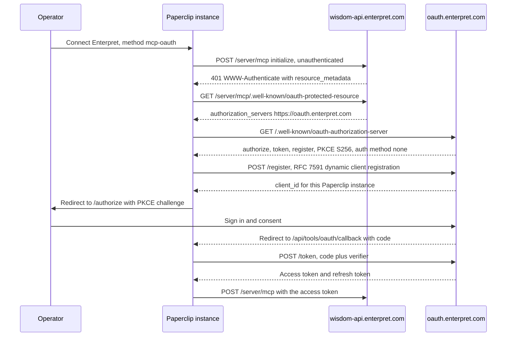

# Enterpret connection

Enterpret's hosted MCP server answers questions about an organization's customer
feedback — themes, accounts, sentiment, and verbatim quotes with citations back
to the source records.

This document follows the template in
[Connection Authoring Runbook](./CONNECTOR-PLAYBOOK.md) and records exactly what
was and was not verified.

**The connector has now been exercised against a real Enterpret account** — a
named account holder signed in through an isolated Paperclip runtime on
2026-09-25 (PAP-18538), and agent tool calls reached the live server. The
organization-token method was separately exercised on an isolated self-hosted
runtime on 2026-09-30.

**Release path:** the **organization auth token** (`mcp-api-key`) is the
primary connection method. Generate a Bearer token under Enterpret
**Settings → Enterpret MCP** and paste it into Paperclip. Public MCP tools are
read-only today; the token path does not depend on Enterpret honouring a
narrowed OAuth grant.

**Current product decision — 2026-10-01:** support both organization tokens
and browser OAuth for the official **read-only Enterpret MCP** at
`https://wisdom-api.enterpret.com/server/mcp`. The account holder reported a
live conversation with Vivek confirming that Enterpret Agent's write MCP is a
separate beta service with known bugs. That service is outside this connector's
scope and will be reviewed separately when ready.

Vivek committed to fixing OAuth scope behavior and reducing the token
revocation cache window. This is a provider commitment relayed by the account
holder, **not verified deployment evidence**. The earlier inference that an
`mcp:write` scope name made this connector write-capable is withdrawn. Both
methods are selectable on this draft branch; fresh OAuth authorization,
refresh and real-agent allow/deny checks remain release QA. The account holder
confirmed the provider fixes are fast follows after deployment, not prerequisites
for shipping this connector.

Several live read and gateway checks passed on the OAuth method. The primary
token path passed connection, catalog, safe read, refresh, and reconnect checks;
a real agent process and server/VPS or Cloud deployment remain unverified.
The dashboard's token revocation did not immediately invalidate the token. See
[Validation Hook](#validation-hook) for the scenario-by-scenario record.

Authored against Paperclip App `fff410dfe777ae0427385e8297df992ba9aed4ce`, with
`CONNECTOR-PLAYBOOK.md` blob `5efd4cca05a1c94bb47d619833ba347f416bbbed` as the
authority. Provider metadata read 2026-09-23 and re-read unchanged 2026-09-25.
Live validation ran on App `ef1606f037a7828a7ba774949e811847c1a1d386`.

## Vendor

- App key: `enterpret`
- App name: Enterpret
- Owner: unassigned. No Paperclip maintainer currently owns an Enterpret account.
- Reuse classification: **MCP-direct**
- Reason for classification: Enterpret publishes an official hosted MCP server
  over Streamable HTTP whose authorization server is discoverable from the
  endpoint itself. No REST shim and no vendor-specific wrapper is needed; the
  tools map onto ordinary read grants.
- Security tier: **S3**
- Plugin needed? No. The provider is expressible as metadata plus a transport:
  no plugin tables, workers, webhooks, or dedicated UI.

### Why a catalog entry at all

An operator can already reach this server with no Paperclip code change, through
**Connect your own MCP server** or **Advanced → Paste a config**
([Generic remote MCP](./GENERIC-REMOTE-MCP.md)). The catalog entry adds only:
official artwork, two labelled methods with the correct client-ownership and
grant-identity shape, a reviewed scope allowlist narrower than the advertised
set, a recorded risk tier, and the provider docs link. Those are real but
incremental. Treat the generic path as the baseline, not as a lesser fallback.

## Transport And Auth

- Transport: `mcp_remote` (Streamable HTTP)
- Endpoint: `https://wisdom-api.enterpret.com/server/mcp`. The bare and
  trailing-slash forms behave identically — `401`, no redirect.
- Auth modes: **API key / organization auth token** (`mcp-api-key`, primary)
  and **OAuth** (`mcp-oauth`). Both methods are selectable on one catalog entry.
- OAuth scopes: requested `mcp:read`. Advertised by the provider: `email`,
  `mcp:read`, `mcp:write`. See [Scope decision](#scope-decision). Fresh OAuth authorization and refresh checks are pending provider deployment.
- Key scope: the Enterpret auth token is generated per Enterpret organization
  and carries that organization's access. Enterpret does not document a
  restricted or read-only token variant. Public tools remain read-only.
- Credential owner: the auth token is an organization credential
  (`grantKinds: ["organization"]`); OAuth is user-delegated
  (`grantKinds: ["user"]`).
- Secret storage: `company_secrets` refs only. The definition records the header
  placement, never a value.
- Revocation behaviour: **no `revocation_endpoint` is advertised.** See
  [Revocation gap](#revocation-gap).

### Connection Flow (mandatory)



- Auth endpoints (exact paths), all read from provider metadata on 2026-09-23:
  - Authorize: `https://oauth.enterpret.com/authorize`
  - Token: `https://oauth.enterpret.com/token`
  - Registration (DCR): `https://oauth.enterpret.com/register`
  - Discovery: `https://wisdom-api.enterpret.com/server/mcp/.well-known/oauth-protected-resource`
    (RFC 9728) → `https://oauth.enterpret.com/.well-known/oauth-authorization-server`
    (RFC 8414). `https://oauth.enterpret.com/.well-known/openid-configuration`
    also resolves.
  - Also advertised: `/introspect`, `/userinfo`. `jwks_uri` points at AWS Cognito
    pool `us-east-2_kLiRrPBis`.
  - Paperclip callback: `/api/tools/oauth/callback`
- Redirect constraints: `https-or-loopback-http` in the definition. An HTTPS
  redirect URI was accepted by DCR and round-tripped through a real consent on
  2026-09-25. Whether Enterpret would also accept a loopback HTTP redirect
  remains **unprobed** — the live run used HTTPS.
- Paperclip ID / Paperclip Connect involvement: **none.** Enterpret is an
  RFC 7591 DCR provider, so registration is instance-local and Cloud and
  self-hosted use the same path. The only per-instance difference is the
  hostname inside the redirect URI.

The definition ships `serverUrl` only. A complete `authorizationEndpoint` +
`tokenEndpoint` pair would be authoritative and would suppress discovery
permanently, including endpoints a previous discovery had persisted. Discovery
resolves cleanly here — the `issuer` in the RFC 8414 document matches the issuer
used to build the URL — so there is nothing to hard-code and nothing to keep
current.

### Scope decision

Paperclip requests `mcp:read` for the official read-only endpoint. The live
2026-09-25 observation is preserved:

```text
Paperclip authorization request  mcp:read
Enterpret token response         no scope field
Enterpret token introspection    openid email profile mcp:read mcp:write
```

This proves a mismatch between requested and reported scopes. It does **not**
prove the token can invoke write tools or authenticate to the separate beta
Enterpret Agent MCP. No write tool was observed or invoked on this endpoint.
The previous description of this as a verified write-capable connector was
stronger than the evidence and is superseded by the 2026-10-01 product decision.

The account holder relayed Vivek's commitment to fix OAuth behavior. Validate a
fresh authorization and refresh against current provider behavior, record
requested and reported scopes separately, and confirm the tool inventory still
belongs to the official read-only service. Do not widen the scope request or
add the beta write endpoint to this definition.

#14059 independently records whether scopes are provider-asserted or inferred
from the request. That improves Paperclip's reporting; it cannot prove a
provider's actual endpoint or capability boundary.

### Revocation gap

The RFC 8414 document advertises no `revocation_endpoint` — re-read 2026-09-25
and still absent. Removing the connection in Paperclip clears local credential
material and gateway access, but there is no documented provider-side instrument
to invalidate an issued OAuth token. The auth-token method is separate: the
dashboard has a Revoke control, but an immediate post-revocation read still
succeeded on 2026-09-30. Whether generating another token invalidates an
earlier one is untested.

An `introspection_endpoint` *is* advertised, and Paperclip calls neither. That
is worth separating: introspection tells you what a token can do, which is how
the scope mismatch above was found, but it cannot take a token away.

Consequence: the OAuth **Revoke and reconnect** scenario cannot reach
`verified` through a provider-side revocation call — confirmed by the live
metadata, not merely predicted. The organization-token Revoke control failed
the immediate denial check. Local removal passed and must be recorded as
exactly that rather than as full provider-side revocation.

**Operator instruction.** Disconnecting Enterpret in Paperclip is only half of
revoking it — and for OAuth the other half is not a procedure this validation
can hand you. The two methods differ, and they must not be described as one:

- **OAuth.** Paperclip cannot revoke the token: no `revocation_endpoint` is
  advertised and Paperclip ships no RFC 7009 client. Whether the Enterpret
  dashboard offers any way to withdraw an authorized MCP client is
  **unverified** — this validation neither found such a control nor confirmed
  one exists, so no step here should be written as if it does. Until Enterpret
  confirms a procedure, plan on the issued token staying valid **until it
  expires**, treat expiry as the only assured end of access, and ask Enterpret
  support for a revocation path rather than assuming the dashboard has one.
- **Auth token.** The dashboard can generate and revoke organization tokens.
  On 2026-09-30 it confirmed "Your token has been revoked," but that same
  token immediately connected again and completed `get_organization_details`
  through an isolated Paperclip instance. Provider-side invalidation therefore
  **failed the immediate check**. Vivek later explained a 24-hour validity
  cache and committed to reducing it; the new delay and deployment are unverified. Do not treat the dashboard confirmation, generating another token,
  or local disconnect as proof of revocation. Confirm the old token is denied.

Any runbook or teardown that treats "disconnect in Paperclip" as provider-side
revocation can leave a live credential at Enterpret. The OAuth grant tested
above also carried `mcp:write`.

## Administrator Setup (mandatory)

- What the admin must register: **nothing.** Enterpret advertises RFC 7591
  dynamic client registration, so the Paperclip instance registers itself at
  connect time. No client ID, no client secret, no callback URL to pre-register.
- Where to register it: not applicable. For the auth-token method, an Enterpret
  admin generates a token at **Settings → Enterpret MCP → Generate** under
  **Auth Token**. Check the expiry shown for each token in the dashboard; the
  token generated for the 2026-09-30 QA run showed **three months**.
- Instance prerequisites: outbound HTTPS to `wisdom-api.enterpret.com` and
  `oauth.enterpret.com`. A public HTTPS base URL is **not** required — that
  applies to the Client ID Metadata Document tier only, and an instance without
  one falls through to DCR.
- How to verify the connection works: after connecting, the connection health
  and catalog check should list Enterpret's tools. `get_organization_details`
  is the narrowest read and identifies which Enterpret organization the
  credential resolves to — run that first, and confirm it is the organization
  you intended.

## Resource Filters

- Required filters: none expressible. Enterpret's MCP surface scopes every call
  to the organization behind the credential; the server documents no per-source,
  per-account, or per-workspace request parameter.
- Optional filters: none.
- Write-enabling filters: not applicable — no write action is exposed.
- Filters enforced by: **the credential itself.** The account boundary is the
  only boundary, which is why the organization a credential resolves to has to
  be confirmed at setup rather than assumed.

## Manifest

- schemaVersion: 1
- slug: `enterpret`
- name: Enterpret
- description: "Ask questions about your customer feedback and pull verbatim
  quotes with citations."
- categories: `["analytics"]`
- branding and provenance: `/brands/apps/enterpret.png`. The official Enterpret
  app icon, 256×256, retrieved 2026-09-23 from the `apple-touch-icon` linked by
  `https://www.enterpret.com/`, unmodified.
  SHA-256 `aca19ddae5f52a2caa4f3664286a76cd9439316e0fa3c39890f646536aebc522`.
  The provider's nav logo is a 120×24 light-on-dark wordmark, wrong shape for a
  square tile and unusable on a light frame; the app icon is the correct
  official mark and needs no dark variant.
- docsUrl: `https://enterpret.support.site/article/enterpret-mcp-server`
- Methods:

| | `mcp-api-key` (primary) | `mcp-oauth` (OAuth) |
| --- | --- | --- |
| label | Use an auth token | Sign in with Enterpret |
| transport | `mcp_remote` | `mcp_remote` |
| auth | `api_key` | `oauth` |
| ownershipModes | `["customer"]` | `["dcr"]` |
| grantKinds | `["organization"]` | `["user"]` |
| defaults | `serverUrl` | `serverUrl`, `scopesHint: ["mcp:read"]` |
| credentialFields | `authorization`, password, required, secret | — |
| keyPlacement | header `Authorization`, prefix `Bearer ` | — |
| riskTier | S3 | S3 |
| release role | Primary / store-ready | Personal browser sign-in; fresh release QA pending |

  `ownershipModes` omits `customer` on the OAuth method on purpose: Enterpret
  documents no way for a customer to register their own OAuth application, and
  `ownershipModes` must reflect what the provider advertises rather than the
  `method()` helper's `["customer", "dcr"]` default.

- oauthStrategy and connectorProfile: not used. This is not a Paperclip-managed
  OAuth provider.
- capabilityProfile and variants: not needed.
- tenantFields and extensionFields: none. There is no tenant identifier to
  supply — the credential determines the organization.
- credentialSources: none. Not Vercel Connect eligible.
- configRequirements: none.
- guidanceMd, warnings, consoleLinks: see the generated definition at
  `packages/shared/src/app-definitions/enterpret.json`.
- riskTier: S3. Enterpret exposes broad content access — an organization's
  complete customer feedback corpus including verbatim quotes with speaker
  attribution. It is not S4: no payments, external sends, refunds, production
  deployment, deletion, or tenant-wide administration is documented.
- requiredResourceFilters: none, for the reason in
  [Resource Filters](#resource-filters).
- urlPatterns: `["https://wisdom-api.enterpret.com/*"]`
- setupPrerequisite: not used; the account requirement is carried in method
  warnings.
- redirectConstraints: `https-or-loopback-http` (unprobed).
- availability: omitted; organization-token and DCR OAuth methods are selectable
  on this draft branch. Browse visibility is enabled. Release readiness still
  requires the account-bound QA recorded below; selectable setup does not mean
  the provider's pending fixes have been verified.

## Actions

**Observed.** An authenticated `tools/list` ran against the live server on
2026-09-25 and returned **8** tools. Two corrections to the previously
documented table:

- `execute_cypher_query` is **absent** from the live server. The legacy alias is
  no longer served, so it cannot be called and does not need a policy.
- Every one of the 8 tools self-reports `readOnlyHint: true` — **including
  `run_graph_query`**. Paperclip trusts provider annotations to derive
  `riskLevel`, so a Cypher-executing tool self-certifies as `read` and lands on
  Allowed by default. That is the provider's claim, not a verified property, and
  it is exactly the case where a provider annotation should not be believed.

**Read the two status columns as the configuration used for the live validation
run.** Shipping defaults now classify `run_graph_query` as **write** (despite
the provider `readOnlyHint`) and put write/destructive actions on **Ask first**
via `recommendedDefaultsForApp` for Enterpret. Other observed tools remain
Allowed reads. The live-run `deny` below was applied by hand and is stronger
than Ask first; operators who want Off can still set that after connect. See
[Governance Defaults](#governance-defaults).

| Tool | Risk | Status in validation | Filters | Approval in validation | Audit fields | Negative case |
| --- | --- | --- | --- | --- | --- | --- |
| `get_organization_details` | read | active | credential org | allow | actor, run, connection, tool, outcome | ungranted actor is denied before dispatch |
| `get_graph_schema` | read | active | credential org | allow | same | same |
| `get_query_examples` | read | active | credential org | allow | same | same |
| `search_graph_fields` | read | active | credential org | allow | same | same |
| `search_graph_values` | read | active | credential org | allow | same | same |
| `run_graph_query` | **write** (Paperclip override) | **deny — set by hand; ships Ask first** | credential org | deny (set by hand) | same, plus redacted query shape | same |
| `find_user_quote` | read | active | credential org | allow | same, plus quote redaction | same |

Legacy aliases `get_schema` and `search_knowledge_graph` remain served for the
lifetime of an existing session and are dropped when the host refreshes its tool
list. `execute_cypher_query` is no longer served at all.

`run_graph_query` currently retains Paperclip's conservative **write** risk
classification and Ask first default because it accepts general Cypher. This
is a Paperclip policy safeguard, not evidence that Enterpret permits mutations.
Vivek's read-only clarification applies to this official MCP. A scope name or
tool name does not establish write access. A later risk-policy change can cite
Enterpret's server-side read-only contract and safe live query proof.

Denial was verified on the live connection: a granted agent calling
`run_graph_query` through the gateway got **HTTP 403 `deny_default`**, and the
tool was absent from that agent's own `tools/list`.

Evidence plan: `find_user_quote` returns verbatim customer text with speaker
attribution, and `run_graph_query` can return feedback records. Do not put
those results in screenshots, exported evidence, or PR text. Paperclip currently
retains provider responses close to verbatim in its invocation log, so a quote
tool call can persist feedback there. Limit access and retention accordingly;
the token-path QA uses only `get_organization_details` and records tool name,
decision, and outcome without copying the payload.

## Wizard Path

- User path (auth token, primary): gallery card → paste the token from
  **Settings → Enterpret MCP** → access defaults.
- User path (OAuth): gallery card → **Sign in with Enterpret** → browser
  authorization using instance-local DCR → access defaults.
- Configuration steps: none beyond credentials. There is no tenant field to
  fill.
- Error states: expired auth token (check the dashboard expiry); an account with no
  access to the organization's feedback. A scope *rejection* turned out not to
  be one of them — Enterpret accepts the `mcp:read` request and reports broader scopes
  (see [Scope decision](#scope-decision)), so the flow completes and the failure
  is silent rather than visible in the wizard.
- Also observed on the live run, and not an Enterpret problem: a headless agent
  hits HTTP 409 `user_authorization_required` on this connection's `per_user`
  credential policy until the user grant is delegated to that agent.
- Redacted metadata shown: endpoint origin and path, method key, resolved
  Enterpret organization from `get_organization_details`, tool names and count.
  Never the token, the authorization code, or feedback content.

## Governance Defaults

- Default profile: Enterpret-specific `recommendedDefaultsForApp` — read
  actions Allowed; write and destructive actions (including `run_graph_query`)
  start as **Ask first**.
- Profile bindings: standard.
- Policies: `classifyRisk(..., "enterpret")` forces `run_graph_query` to
  **write** even when the provider advertises `readOnlyHint: true`. Combined
  with Ask-first defaults, new connections no longer ship that Cypher tool as
  Allowed. Operators who want **Off** can still set that after connect.
- **Narrowing an install is not a containment control.** The gallery connect
  flow creates both a company install and a company-level binding of the
  `app:<connectionId>` profile. Restricting the install to named agents rewrites
  the install and adds an agent binding but leaves the company binding in place,
  which keeps authorizing every agent in the company. Installs gate runtime
  materialization; the *profile binding* is what authorizes. Containment becomes
  real only when the company binding is also removed. Verified on the live
  connection: both agents still resolved 7 allowed tools after the install was
  narrowed, and the ungranted control agent dropped to 0 of 8 only after the
  company binding was unbound.
- Quarantine rules: `quarantineNewEntries` is connection-level runtime setup,
  not an `AppDefinition` field. Paperclip enables it for Enterpret connections.
  Enterpret's catalog demonstrably drifts — it renamed three tools and kept the
  old names as session-scoped aliases, and `execute_cypher_query` has since
  disappeared entirely — so newly advertised tools are held for review on a
  subsequent catalog refresh, including after token replacement. The earlier
  live run found the old default was
  `false`; the new default still needs live refresh validation.
- Rate limits: none set.

## Validation Hook

### Organization auth-token QA (2026-09-30)

This was a separate **self-hosted, same-machine** run on an isolated worktree,
database, and Paperclip instance at App commit
`dbe63eaae16fdb2f5386b324067e482f84f7fc7a`. The account holder generated
one QA-only organization token in Enterpret's MCP settings. Its dashboard
showed **Expires in 3 months**, so setup copy must not promise six months.
The token value, feedback content, and full provider responses are excluded
from this record.

| Check | Observed result |
| --- | --- |
| Connect and discover | `mcp-api-key` connected as an organization grant; health was `ok`; authenticated catalog refresh found 8 tools. |
| Safe allowed read | `get_organization_details` returned success for the intended Enterpret organization. The same bounded read succeeded again after reconnect. No quote or graph-query tool was invoked. |
| Agent policy preview | The selected test agent's access summary changed the read action to `off` and back to `allowed` when its profile was toggled. The Test panel showed “No call will be made” while Off. |
| Refresh and reconnect | Catalog refresh retained 8 actions. Reconnecting with the same valid token preserved the connection and catalog quarantine setting. An intentionally invalid replacement failed, then reconnecting with the valid token restored `active`/`ok`. This is **not** evidence that an expired token was renewed or that rotating a token revokes its predecessor. |
| Activity | The safe call produced an explicit-grant decision and completed-call event. Connection activity remained queryable. |
| Local disable and removal | Disabling the QA connection exposed zero actions in the agent access summary. Archiving it cleared the local secret, grant, install, and catalog entries. |
| Provider-side revocation | After the Enterpret dashboard said the QA token was revoked, the same token immediately connected again and completed the same bounded organization read. Immediate provider-side invalidation **failed**. Vivek later explained invalidated tokens remain cached for 24 hours and committed to reducing the window. The new delay and deployment are unverified. Both QA connections were removed. |
| Actual agent execution | Not exercised on this token path. An earlier OAuth QA run proved agent-session denies through the real gateway, but it does not substitute for a token-path agent process. |

The board's `POST /tool-connections/:id/test-calls` is **not** an agent-policy
denial probe. With the agent's action Off, that endpoint still returned
`allowed` and invoked the safe provider read because it evaluates the board
user's policy. The agent access summary and Test panel correctly showed Off.
This mismatch is a shared Test endpoint issue, already noted in the OAuth QA
below; do not cite the test call as proof of an agent deny. The QA profile was
restored to Allowed. No customer-feedback content was requested.

This run did not exercise a real agent process, a self-hosted VPS, or Cloud.
Those remain separate verification steps before claiming those deployment
shapes.

### Earlier OAuth QA (2026-09-25)

- Environment: an **isolated, issue-owned Paperclip runtime** on the maintainer
  host — its own `PAPERCLIP_HOME`, its own embedded Postgres, its own ports,
  reachable tailnet-only over HTTPS. It shared nothing with any other instance:
  no database, no credentials, no ports, no worktree. Torn down after the run.
- Deployment shape: **self-hosted, same machine.** Self-hosted VPS and Cloud
  remain untested, and nothing below is inferred for them.
- Method keys exercised: `mcp-oauth`. `mcp-api-key` remains untested.
- Date and tested commit: 2026-09-25, App
  `ef1606f037a7828a7ba774949e811847c1a1d386`
- Account: a named Enterpret account holder signed in personally through the
  isolated UI and consented. Paperclip never saw a password, an OTP or an
  authorization code, and no token value appears in any artifact.
- Client registration: dynamic. `registrationSource: "dcr"`, a **public** client
  (`token_endpoint_auth_method: none`, so there is no client secret). Nothing
  was pre-registered by hand.
- Provider metadata: re-read on the day of the test and unchanged from the
  2026-09-23 reading, field for field.

Unauthenticated reproduction — these need no account and are safe to re-run:

```sh
curl -s -i -X POST https://wisdom-api.enterpret.com/server/mcp \
  -H 'Content-Type: application/json' \
  -H 'Accept: application/json, text/event-stream' \
  -d '{"jsonrpc":"2.0","id":1,"method":"initialize","params":{"protocolVersion":"2025-06-18","capabilities":{},"clientInfo":{"name":"probe","version":"0"}}}'
curl -s https://wisdom-api.enterpret.com/server/mcp/.well-known/oauth-protected-resource
curl -s https://oauth.enterpret.com/.well-known/oauth-authorization-server
```

Reproducing the scope finding needs a live token. The shape of the check, with
the token withheld:

```sh
# RFC 7662. `scope` here is the scope OF THIS TOKEN, which is the only place
# the scope mismatch is visible: the token is opaque and the token response omitted
# `scope` entirely.
curl -s https://oauth.enterpret.com/introspect \
  -d "token=$ACCESS_TOKEN" -d "client_id=$DCR_CLIENT_ID"
# -> {"active": true, "scope": "openid email profile mcp:read mcp:write", ...}

# Negative control, same client_id, bogus token. Proves the scope is bound to
# the token rather than echoed back from the client registration.
curl -s https://oauth.enterpret.com/introspect \
  -d "token=not-a-real-token" -d "client_id=$DCR_CLIENT_ID"
# -> {"active": false, "rejection_reason": "invalid_token"}   (no `scope` field)
```

**Method note for the next connector.** Do not use
`POST /tool-connections/:id/test-calls` to show that an ungranted agent is
denied. It accepts an `agentId` and returns a `decision`, so it reads like an
agent-authorization probe, but it evaluates policy as the **board user**, which
is full-control by design. During this run it returned `decision: "allowed"` and
executed a real provider call for an agent that was denied on all 8 tools. Every
denial row below was instead produced through the real agent path: mint an agent
API key, open a gateway session, and call with the session token.

### Nine production-validation scenarios

Per deployment, self-hosted first. Cloud has no evidence of any kind and is
never inferred from a self-hosted result.

| Scenario | Self-hosted, same machine | Self-hosted, server/VPS | Cloud |
| --- | --- | --- | --- |
| Setup and consent | **pass** — account holder signed in; connection reached `active`, health `ok` | not run | not run — no Cloud instance |
| Authentication | **pass** — DCR public client registered against the live provider; token exchange succeeded | not run | not run |
| Catalog and configuration | **pass** — authenticated `tools/list` returned 8 tools; `execute_cypher_query` absent | not run | not run |
| Allowed execution | **pass** — `get_organization_details` resolved to the intended organization; one further bounded metadata read also succeeded | not run | not run |
| Denied execution | **pass** — ungranted agent got HTTP 403 `deny_default` and saw 0 tools; `run_graph_query` stayed 403 for the *granted* agent | not run | not run |
| Runtime delivery | **not proven** — gateway and policy were exercised by a real agent-authenticated session, but no agent process ever ran; see below | not run | not run |
| Refresh and recovery | **not run** — refresh deliberately not exercised once the scope mismatch was found | not run | not run |
| Revoke and reconnect | **cannot pass** — no `revocation_endpoint` exists to call. Local disable verified: the connection was disabled and the gateway decision flips to deny | cannot pass — structural, not deployment-dependent | cannot pass |
| Activity and secret handling | **pass** — invocations audited with correct decisions and actor attribution; tokens AES-256-GCM at rest with no plaintext in secret storage; API returns `secretId` references only | not run | not run |
| **Granted scope (OAuth)** | **scope mismatch observed** — reported scopes differed from the request; write capability was not established; fresh OAuth QA pending | fails identically for OAuth — provider-side | fails identically for OAuth |

Self-hosted VPS and Cloud are `not run`, not "probably fine". Nothing in the
same-machine column is carried across, and nothing here is carried over from the
PAP-18519 loopback mirror either.

**Why runtime delivery is `not proven`, precisely.** Every allowed and denied
result above was produced through the real gateway path — an agent-minted
session, `actor_type: agent` on the invocation row, decided by the real policy
service. What did **not** happen is an agent *process*. Minting that session
requires a `heartbeat_runs` row, and the two rows used here were inserted by
hand for that precondition alone. Both show `started_at` NULL, no pid, no
transcript and no run events other than the reaper's, and the instance later
marked them `failed` / `process_lost` — which is the reaper correctly noticing
there was never a process behind them, not a product defect. So this connector
is proven to work under Paperclip's *authorization and transport* layer, and is
untested under an actual agent runtime driving it through a heartbeat. Scenario
6 needs a genuine woken agent run before it can be called a pass.

Three further findings from the run, recorded because they change how an
operator should read this connector rather than what it does:

- **`per_user` credential policy blocks unattended agents.** A headless run has
  no acting user, so a `kind: user` grant yields HTTP 409
  `user_authorization_required`. The minimal fix is a delegation of that one
  grant to that one agent — narrower than promoting to an organization grant,
  and it widens nothing at the provider. The delegation path additionally
  requires the run's `invocationSource` to be `automation` or `timer`; an
  `on_demand` run stays 409. Note `credentialPolicy: per_user` is a runtime
  default here, not something this definition pins.
- **Tool results are persisted close to verbatim.** `result_summary` on an
  invocation stores the provider response body with an empty `redactedFields`.
  It stays in the instance database, but for Enterpret that means a
  `find_user_quote` result would write customer feedback text into the run log.
  `find_user_quote` was deliberately **not** called during validation.

### Deployment support matrix

Labels as defined in the connector skills' shared matrix.

| Capability | Self-hosted, same machine | Self-hosted, server/VPS | Cloud |
| --- | --- | --- | --- |
| Definition generates, validates and typechecks | `verified` | `verified` | `verified` — the checks are deployment-independent |
| Official branding passes the artwork checks | `verified` | `verified` | `verified` |
| Provider metadata discovery resolves (RFC 9728 → 8414) | `verified` against the provider, from this runtime | `verified` — same request, no deployment dependency | `untested` |
| Paperclip's discovery ladder resolves this shape | `verified` against the live provider | `untested` | `untested` |
| DCR client registration | `verified` — public client registered at connect time, nothing pre-registered | `untested` | `untested` |
| OAuth consent and token exchange | `verified` | `untested` | `untested` |
| Auth-token (header) connection | `verified` — connected, discovered 8 tools, and completed a safe read on 2026-09-30 | `untested` | `untested` |
| Authenticated `tools/list` | `verified` — 8 tools on OAuth and the organization-token path | `untested` | `untested` |
| Agent execution through the gateway | `verified` on OAuth — allowed and denied paths through an agent-authenticated session; token path used the board Test panel only | `untested` | `untested` |
| Execution driven by an actual agent runtime | `untested` — the sessions above were minted against hand-inserted run rows; no agent process ran | `untested` | `untested` |
| Granted scope matches the requested scope (OAuth) | `scope mismatch observed` — fresh OAuth QA pending; scope names do not establish write capability | `failed` for OAuth — provider-side | `failed` for OAuth — provider-side |
| Provider-side revocation | OAuth has no advertised `revocation_endpoint`; the organization token's dashboard Revoke control failed an immediate denial check on 2026-09-30 | `untested` | `untested` |
| Store visibility (token path) | `ready` — organization auth token is primary; both auth methods target the official read-only MCP | `ready` — same definition | `ready` — same definition |

### What must happen before this is store-visible

**Organization auth token path (primary) — release criteria**

Steps 1–3 below are **done** as of 2026-09-25 and are kept for the record. The
mechanical store-visibility flip for the token path is also done on this branch
(clear `availability`, remove `"enterpret"` from `APP_STORE_HIDDEN_SLUGS`, set
`catalogVisible: true`). Remaining follow-ups improve confidence; they are
**not** blocked on Enterpret fixing OAuth scopes.

1. ~~An authorized Enterpret organization credential, held by a named owner.~~
   **Done** — a named account holder signed in personally (OAuth path).
2. ~~An authenticated `tools/list`, to replace the documented tool table with an
   observed one and to classify `run_graph_query`.~~ **Done** — 8 tools
   observed. `run_graph_query` is still not classifiable: its only annotation is
   the provider's own `readOnlyHint: true`, which the live evidence gives no
   reason to trust. Enterpret states public tools are read-only today; treat
   that as product guidance, not a substitute for a Paperclip deny policy.
3. ~~Authorization to attempt DCR against `oauth.enterpret.com`.~~ **Done** —
   DCR succeeded; a public client, no pre-registration needed.
4. ~~Catalog visibility for the token path.~~ **Done on this branch** —
   `availability` cleared, `"enterpret"` removed from `APP_STORE_HIDDEN_SLUGS`,
   `catalogVisible: true`, tests and Storybook updated so organization auth
   token is primary. OAuth is now selectable for the official read-only MCP.
5. **Partly done 2026-09-30:** `mcp-api-key` connected on an isolated
   self-hosted instance; authenticated catalog, bounded allowed read, refresh,
   failed replacement and valid reconnect, local disable, removal, and activity
   passed. Token-path agent-session deny remains untested. The board Test
   panel's Off preview is not a substitute for that check.
6. **Partly done:** reconnect with the same valid token and recovery from an
   invalid replacement passed. Recovery from actual expiry and server/VPS
   deployment remain untested. The dashboard's revocation confirmation failed
   the immediate invalidation check; old-token invalidation after rotation was
   not tested.

**Both auth methods — release validation and provider follow-up**

OAuth is supported for the official read-only MCP. Before calling the new
revision release-ready:

- Test a fresh OAuth authorization and refresh against the current provider.
  Record requested and reported scopes without
  treating scope names as proof of access to the beta Agent MCP.
- Exercise a safe allowed read and a denied call through a real agent session;
  the board Test endpoint does not prove agent authorization.
- Document the current revocation behavior: invalidated tokens can remain
  active in Enterpret’s cache for up to 24 hours. Local disconnect removes
  Paperclip’s stored credential and access, but does not immediately invalidate
  copies elsewhere. The account holder accepted shipping with this known limit.
- After deployment, follow up on Enterpret’s OAuth fix and reduced revocation
  window. Confirm the new maximum delay and retest after the provider deploys
  those fixes. These provider changes are fast follows, not release gates.
- Keep Enterpret Agent's beta write MCP outside this PR. Adding it later needs
  separate endpoint, credential-boundary, action-risk, and write QA review.

The connector can ship with current provider behavior once Paperclip’s
functional QA, CI, and review pass. Keep the PR draft until those checks pass;
do not block release on the provider’s fast-follow fixes.
