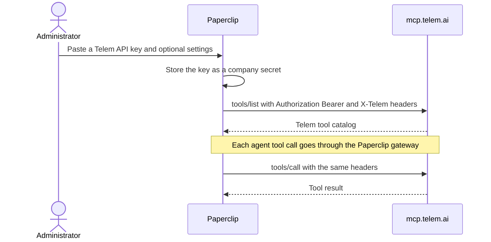

# Telem.AI connection

Updated: 2026-10-03. Status: catalog definition added. The API key method was
verified on a local instance: setup, catalog discovery, gateway `tools/list`
and one read-only `tools/call`. Live account qualification by a maintainer is
outstanding.

Paperclip connects to the Telem.AI hosted MCP server at
`https://mcp.telem.ai/mcp`. Telem.AI gives agents web search and page fetch
across many search providers with one API key.

The connection has one method: a Telem API key stored as a Paperclip secret
and sent as an `Authorization: Bearer ...` header. Telem.AI does not offer
browser sign-in or a keyless profile.

The curated connection adds branding, guidance and four optional settings.
None of it is required to reach the server. Telem.AI can also be connected
from **Connect your own MCP server** with the same URL and header. See
[Connecting any remote MCP server](./GENERIC-REMOTE-MCP.md).

## Service involvement

Telem.AI hosts the MCP resource. Paperclip ID and Paperclip Connect do not
take part. Cloud and self-hosted instances use the same path. There is no
OAuth flow and no Paperclip callback.

| Purpose | Endpoint |
| --- | --- |
| MCP resource | `https://mcp.telem.ai/mcp` |
| API keys | `https://app.telem.ai` |
| Documentation | `https://docs.telem.ai` |
| Authorize, token, registration | none (API key only) |
| Paperclip callback | n/a |

## Administrator setup

1. Create an API key in the Telem console at `app.telem.ai`.
2. In Paperclip, open **Apps**, choose **Telem.AI**, and paste the key.
3. Optional: open **Advanced** and set the settings below.
4. Choose which agents get access, then finish.
5. To verify, open the connection's **Permissions** page and click **Test**
   beside `telem_providers`. It is read-only and returns the list of available
   search providers.

No callback URL, client registration or instance feature flag is needed.

## Settings

All settings are optional and apply to every agent that uses this connection.
Paperclip sends each one as a request header. It leaves a header out when its
setting is empty.

| Setting | Values | Header |
| --- | --- | --- |
| Auto routing | Off, Accuracy | `X-Telem-Auto-Routing` |
| Tier | Minimalist, Default, Extended, Max | `X-Telem-Tier` |
| Providers to include | comma-separated provider names | `X-Telem-Providers-Include` |
| Providers to exclude | comma-separated provider names | `X-Telem-Providers-Exclude` |

The setup form cannot clear a select after a value is chosen. To turn auto
routing off again, select **Off**. **Default** is the server's default tier.

## Resource filters

None. Telem.AI tools read public web content and do not act on customer
resources.

## Actions

| Tool | Risk | Purpose |
| --- | --- | --- |
| `telem_search` | read | Search the web across providers |
| `telem_fetch` | read | Read the content of known URLs |
| `telem_providers` | read | List the available search providers |
| `telem_session_history` | read | Read earlier results of a search session |

Usage is billed to the Telem account that owns the API key.

## Manifest

- slug `telem`, name `Telem.AI`, category `ai`, risk tier `S2`
- method `mcp-api-key`: `mcp_remote`, `api_key`, `keyPlacement`
  `Authorization` with prefix `Bearer `
- `tenantFields`: `autoRouting`, `tier`, `providersInclude`,
  `providersExclude` (all optional, all header transport)
- branding: the official Telem mark, `ui/public/brands/apps/telem.svg` and
  `telem-dark.svg`
- source: `scripts/ingest-app-definitions.mjs` (`specialMethodsFor`, slug
  `telem`) and `packages/shared/src/self-serve-mcp-research.json`
