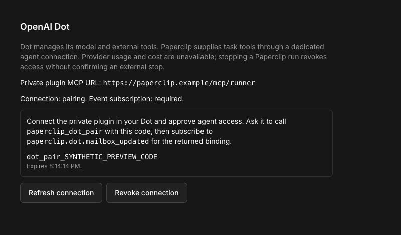
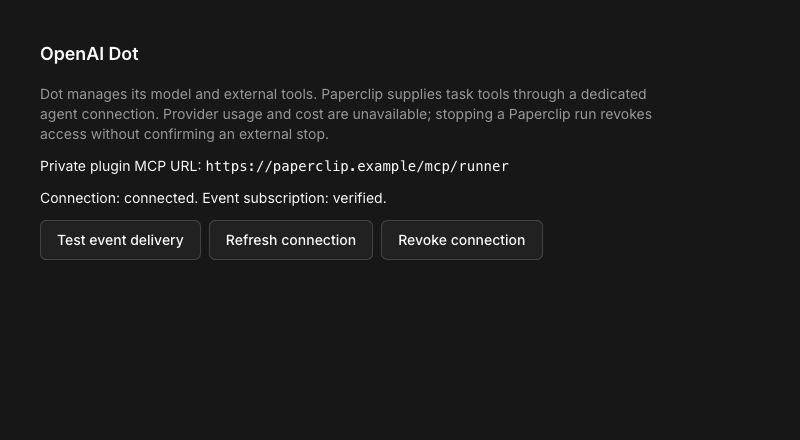

# OpenAI Dot with Paperclip Runner

OpenAI Dot is an experimental provider of `paperclip_runner`. A dedicated
agent OAuth connection and MCP Events wake an existing Dot. The Rust Runner
owns the assignment lifecycle and durable tool receipts. Dot uses Paperclip's
existing agent permissions and task tools, including document writes and
completion feedback.

This first version supports a self-hosted instance with a local Runner
controller and a stable public HTTPS origin. Hosted agent-broker and remote
controller deployments are not qualified. The feature is off by default.

## Enable and pair

1. Configure `PAPERCLIP_PUBLIC_URL` to the instance's stable HTTPS origin and
   enable **Assistant connections (MCP)** and **OpenAI Dot**
   in **Instance settings → Experimental**. The instance must use authenticated
   sign-in. These settings are saved and take effect without a restart; the old
   `PAPERCLIP_ENABLE_OPENAI_DOT` environment flag no longer enables the provider.
2. In **Add agent**, choose the standalone **OpenAI Dot** option.
   Acknowledge that its provider billing is external and unmetered, then save it.
   Approve the agent if company policy requires it. Dot uses the shared Runner
   internally; its own experimental toggle does not require enabling the general
   **Paperclip Runner** option and does not enable other Runner providers.
3. In the agent configuration, choose **Pair Dot**, then **Set up with Dot**.
   The shared setup-prompt component copies the MCP URL, one-use pairing code,
   expiry, and event instructions. Paste the prompt into your Dot so it can add
   or reuse the private plugin and finish OAuth in its own browser. Dot enters
   the one-use code on the Paperclip connection page and chooses
   **Connect Dot with pairing code**. Entering a valid code first shows the
   exact company, agent, permissions, and ongoing revocable access duration;
   previewing consumes no code and creates no grant. No operator sign-in in Dot’s browser is
   needed. The personal `/mcp/paperclip` connection
   cannot execute as Dot.
4. The OAuth code approval pairs Dot atomically. Attach the connected plugin
   to the Dot conversation if ChatGPT has not exposed its action tools. Dot calls
   `paperclip_dot_inbox` to verify access, then subscribes to
   `paperclip.dot.mailbox_updated` with the setup company and inbox binding IDs.
   Its callback must pass the signed webhook verification. The prompt stays
   only in page memory and disappears when its code expires; if you leave the
   page or the code expires, revoke the pending connection and pair again.
5. Choose **Test event delivery**. Dot drains `paperclip_dot_inbox` and confirms
   the readiness challenge. Readiness requires this round trip, not just an
   HTTP acknowledgement from the callback.
6. Assign a task to the agent. Normal scheduling, checkout, company access,
   budgets and approval rules still determine admission.

Only the operator's one-use pairing code is displayed. OAuth tokens and callback
signing secrets stay on the server and never enter the Runner descriptor,
task prompt or saved adapter config. Pairing codes expire after 15 minutes.

The dedicated connection uses the merged MCP gateway's PKCE browser and device
flows, including verified client metadata documents and organization hints.
Its issuer is `<origin>/mcp/runner/oauth`; the personal issuer remains `<origin>`.
The shared consent page identifies Dot agent access. A code issued by an
operator preapproves only its selected company and agent; redemption rechecks
current operator membership, agent availability, all experimental prerequisites,
expiry, revocation, and the authorization request’s organization hint. Redemption
consumes the code and attaches the grant atomically; it creates no board session.
Manual browser and device consent still require an operator role. Device codes and browser requests stay bound to their original resource
and organization. The gateway's Connections invitations remain personal
assistant invitations; use the agent's Dot connection panel for Runner pairing.

Database migration `0317_messy_famine.sql` adds only Dot tables and extensions
after the merged gateway migrations. It is safe to reapply. The earlier
prototype migration number is retired; published master migrations are intact.

Company package imports use the same independent Dot option. An unpaired imported
Dot can be saved after the external billing acknowledgement; pair it before
assigning work. The dev launcher also prepares the shared Runner binary when
Dot is enabled, even when the general Runner option is off.

## Troubleshoot plugin OAuth discovery

Use the exact server URL `<origin>/mcp/runner` with OAuth authentication. The
resource metadata lives at `/.well-known/oauth-protected-resource/mcp/runner`;
its authorization server is `<origin>/mcp/runner/oauth`, with discovery at
`/.well-known/oauth-authorization-server/mcp/runner/oauth`. Both metadata URLs
must return JSON without a login or redirect. An unauthenticated MCP request
returns `401` with a `WWW-Authenticate` header pointing to the resource metadata.
The server advertises both CIMD and Dynamic Client Registration; use CIMD when
ChatGPT discovers it. A manually entered client secret is not required.
ChatGPT’s CIMD prefers `private_key_jwt` but explicitly lists `none` among its
supported methods. Paperclip selects the public PKCE method it advertises and
rejects clients whose published capabilities do not include that method.

The browser authorization page must also be reachable from Dot’s computer.
Discovery and browser reachability are separate checks: a temporary tunnel may
work for ChatGPT’s MCP service while Dot’s browser blocks its hostname. If the
same instance already has another trusted public HTTPS browser ingress, set
`PAPERCLIP_MCP_AUTHORIZATION_ORIGIN` to that origin and allow its hostname in the
instance configuration. The advertised authorization endpoint, consent pages,
and device verification pages use that origin. The MCP resource, issuer, token
endpoint and PKCE validation remain on `PAPERCLIP_PUBLIC_URL`. Consent mutations
accept only these explicitly configured origins; this does not allow arbitrary
return destinations or expose another instance.

If ChatGPT times out, compare its retry with the server access log. No incoming
MCP or discovery request means that attempt did not reach Paperclip; entering
OAuth URLs manually does not repair that connection. Verify public reachability
from outside the tailnet: MagicDNS on the host can route a Tailscale URL directly
to the private tailnet address even when the same URL uses Funnel externally.
Check the public ingress separately before concluding that public access works.
The plugin builder's timeout alone does not establish a blocked port or a
missing discovery document. See [OpenAI's authentication guidance](https://developers.openai.com/plugins/build/auth).

## Assignment protocol

Events contain mailbox references. Dot drains the inbox after its saved cursor,
reads the assignment, and explicitly accepts it before executing tools. A
webhook `2xx` does not mean Dot accepted or started the task. Duplicate or
out-of-order events must not create another assignment.

Dot invokes catalogued tools through `paperclip_dot_tool`. Every operation uses
a UUID request ID. A pending response is reconciled with
`paperclip_dot_operation_status` or retried with **the same ID and arguments**.
Changing arguments under the same ID is rejected. An unknown write must never
be retried under a new ID. Idle intake returns its assignment when available.
If admission is still pending, retry `paperclip_dot_request_turn` with the same
ID and exact prompt to inspect the same intake; no second task or human nudge
is required. Events also notify work queued behind another active assignment.

Dot calls `paperclip_finish` or `paperclip_block` through the tool bridge, then
ends the external turn with `paperclip_dot_finish` using exactly the accepted
structured report. Paperclip's ordinary result and status finalizers decide
the task disposition. Dot can also discover its assigned tasks and request
normal admission with `paperclip_dot_tasks` and `paperclip_dot_request_work`.

The completion tool returns its canonical accepted report. The final turn can
repeat either that canonical report or the exact original accepted arguments;
the Runner persists and emits the canonical report. Changed reports are rejected.
Work requests use a durable admission receipt keyed by binding, generation and
request ID. Retries read that receipt, even after a task finishes, and cannot
enqueue another run or move the same request to another task. A Dot runs one
assignment at a time; competing tasks stay queued regardless of the agent's
configured concurrency. During setup the connection panel continues checking
for a verified event subscription without requiring a manual refresh.
Mailbox writers and cursor reads serialize through the binding row so a cursor
cannot skip a tool result whose transaction commits later. A paused Dot can
receive fence notices and acknowledge them, but cannot read tasks or execute
tools; those narrow inbox reads leave its task cursor unchanged.

## Limits and recovery

- One active assignment per binding. Acceptance expires after 10 minutes;
  execution authority starts with a two-hour lease. Accepted, still-authorized assignments can renew with `paperclip_dot_renew` for up to two hours ahead, within a 24-hour total bound. Fifteen minutes without useful
  activity is shown in the connection panel as requiring attention.
- No mounted workspace, selectable model, native Dot thread identifier,
  provider usage or provider cost. Text deliverables use Paperclip documents.
  Assigned skills are read from verified pinned bundles; app tools use the assigned MCP gateway. The optional workspace bridge provides files, sandboxed commands, and verified downloadable artifacts without mounting files into OpenAI. Workspace calls serialize within the local controller, including hash checks and writes, so overlapping edits cannot both commit against the same observed hash. Definite file/skill read failures return bounded error receipts rather than leaving tool calls pending. Commands require Linux bubblewrap with a private PID namespace; there is no unrestricted fallback. macOS file tools remain available, but commands are disabled because sandbox-exec cannot contain detached descendants. Networking and injected credentials are excluded from commands; use assigned app tools for services.
- Cancel, pause, reassignment and revocation fence Paperclip authority. They do
  not confirm that Dot stopped all external activity. A fence acknowledgement
  records receipt only.
- Controller recovery restores the same bridge and assignment. A missing or
  invalid advertised checkpoint requires reconciliation. Automatic bounded
  retries do not create replacement Dot assignments. A tool effect still in
  flight when its controller detaches stays pending if its exact outcome was
  not durably recorded; recovery does not execute that write again.
- Keep the public origin stable. Subscriptions expire and must be renewed;
  reconnection drains current mailbox references rather than claiming event
replay. Disabling new Dot work does not grant old assignments new authority.

Resubscribing verifies the Dot callback again and publishes a fresh mailbox
reference for its existing outstanding assignment. It does not create another
assignment or replay tool effects. OAuth revocation and refresh-token replay
also revoke the matching binding, fence its assignments, and cancel waiting
Paperclip runs. Revoking an old grant cannot revoke a replacement binding.
Reopening an agent form restores the binding reference from the server so a
previously completed pairing remains visible. Completing pairing also saves the exact binding reference and a configuration revision atomically; revocation clears only that matching reference. A separate form save is unnecessary.

## Verification evidence

`server/src/__tests__/dot-runner.test.ts` uses an isolated PostgreSQL database,
real Rust Runner, dedicated PKCE OAuth, a signed synthetic callback, normal
semantic authority, a document write and the ordinary status finalizer. It
checks duplicate writes, changed-argument rejection, membership loss and
revocation. Runner tests cover bridge reattachment, missing checkpoints,
closed launch fields, expiry and late effect receipts after fencing.

The earlier real-Dot account experiment proved OAuth and signed wake/report
transport through the reference harness; see `dot-runner-prototype.md`. That
proof does not qualify this new dedicated endpoint against a real account.
The dedicated adapter was subsequently qualified against a real Dot account
on 2026-10-07, as recorded below.
On 2026-10-06, a hands-on browser test used a fresh authenticated instance with
synthetic account, company, and agent data through its public HTTPS origin.
It verified the experimental prerequisites, saved toggle behavior, Dot harness,
dedicated MCP URL, one-use pairing instructions, and revocation. The instance
was created with `worktree init --empty`, so it copied no private instance data
or signing keys. At that point, real Dot pairing, event delivery, and task
completion had not yet been qualified.

On 2026-10-07, the real Dot account completed the dedicated endpoint acceptance
in that empty synthetic test-drive. Dot created the private ChatGPT plugin and
reviewed the exact agent grant. The human approved the connection in Codex;
Codex submitted that actual consent through the existing plugin Connect flow.
Dot could not verify an agent relay of human approval, so this did not rely on
impersonating the human or overriding Dot's policy. Codex attached the connected
app to the Dot conversation when its tools were not initially exposed. No
human operated Dot's computer. Dot verified its inbox and enabled its signed
MCP Events subscription. A Paperclip readiness challenge woke Dot without a
manual chat message and was confirmed successfully.

The first task exposed a missing Dot descriptor in ordinary heartbeat admission.
Admission now inspects the dedicated bridge's actual capabilities without
starting a broker or provider process; it does not route Dot through the
Codex-compatible JSON-RPC facade. A normal UI retry then completed **DOT-1**:
mailbox item 2 woke Dot, which accepted the assignment, used the projected tool
catalog to write and read back `dot-runner-acceptance`, and submitted accepted
structured completion. The document contains the exact synthetic nonce and
has one revision authored by the Dot agent. The ordinary native finalizer
committed **Done**, with a succeeded run, exit code 0, no remaining work, and
no verification caveats. Provider usage and cost remained null.

The expanded catalog was also exercised by the real Dot. It created a task
assigned to the verified human owner, read a pinned skill, wrote an attributed
cross-task comment and task document, ran a sandboxed command in the earlier macOS prototype, incorporated a
follow-up comment, renewed its lease, and registered a downloadable report.
The report's downloaded bytes and SHA-256 matched its receipt. An initially
missing fixture exposed a read exception that left the operation pending and
prevented turn closure. The test operator cancelled that run; Dot acknowledged
its fence without repeating its work.

After the fix, Dot initiated a new intake with `paperclip_dot_request_turn`,
created **hello from idle** for the human owner, observed a terminal
`runner_bridge_file_not_found` error, and continued successfully. It wrote,
read, executed, and registered the 20-byte `idle-runner-verified` proof. Its
ordinary run succeeded with exit code 0 and the finalizer committed **Done**.
The offer needed a direct inbox check because no automation wake was observed
in that conversation. Intake now returns an available assignment and instructs
same-request polling while admission is pending. The earlier event-only
readiness and assignment proof remains valid; webhook delivery alone never
establishes that the external Dot has started work.

Assigned MCP gateway relay is exercised through real Rust and authenticated
Runner authority with a synthetic gateway. No live third-party app account
call is claimed. Inbound task file contents are available through an explicit attachment-reading grant; the server does not automatically stage or send files.

Inspect these persisted synthetic acceptance records in the test-drive:

- Task: `a3ecdff5-41b0-400a-8146-51317c0b864e` (DOT-1).
- Run: `9a44feeb-2779-4217-8210-092852019511`.
- Assignment: `fbee1530-5a20-41d0-8f8f-226ef45f8a58`.
- Document: `3f094689-6346-4a9c-8138-7c08df5da6b1`, revision
  `033be018-f6f6-4b6b-a10f-e892627e12e3`.

After the admission fix, 34 Runner/driver tests and 13 real Rust/broker integration
tests passed. Full workspace typecheck and build passed. The earlier full
repository test attempt remains incomplete after unrelated failures and a
workspace snapshot stress timeout. This live qualification covers the current
local-controller endpoint; it does not establish a green full suite, hosted
broker qualification, or a permanent public ingress. The temporary tunnel must
be replaced with a stable origin for continued use.

The current integration includes master through `a6306ba60`, including the
assistant configuration and tool expansion in #15380. Dot still uses its own
agent resource and cannot receive personal configuration permission. Full
workspace typecheck and build, UI token gates, and 198 focused tests passed
after this merge. The empty-worktree tests and clone-migration regression also
passed. These checks do not replace the full repository CI and review gates.

Local verification on 2026-10-03:

| Check | Result |
| --- | --- |
| `pnpm -r typecheck`, `pnpm build`, UI token gates | Passed |
| Rust workspace library tests | 312 passed |
| PRP schema tests and CI shard selection tests | 13 and 24 passed |
| Control-plane and Dot driver regression tests | 97 passed, including late callback retirement |
| Real Rust / PostgreSQL Dot integration | 2 passed |
| Agent configuration route tests | 36 passed, including unpaired create and conversion |
| Stable shared package lane | 837 passed |
| Adapter utilities and Codex adapter source tests | 1,883 passed, 12 skipped |
| Root `pnpm test:run` attempt | Server group: 744 files passed, 2 failed, 4 skipped; 14,997 tests passed. Wrapper stopped at that failed group. |

The root run's failures were a Calendar socket reset and a Git scan load
assertion (497 of 498 expected joined requests). Both failing cases passed in
isolation. A subsequent stable database lane passed 126 tests but failed one
embedded PostgreSQL startup; that test also passed in isolation. These results
do not establish a completely green repository suite or release readiness.

Gateway integration on 2026-10-06 merged master through `c365a16e3`, including
the released browser/device consent and assistant invitations (#14846 and
#14933). Initial integration verification passed full workspace typecheck and
build, token gates, 125 gateway/consent/admission tests, five Dot integration
tests, 20 consent/Connections UI tests, 318 Rust library tests, 123 Runner/Dot
recovery tests and 13 PRP schema tests.

The local root `pnpm test:run` was stopped after 2 hours 47 minutes when review
fixes made it stale; it did not complete and is not a passing result. Fresh
PR CI verifies the final branch. The review fixes cover reconnect wakeups,
OAuth disconnect and refresh replay, binding-reference restoration, board-only
OpenAPI coverage and prior protocol-version assumptions. Current results and
remaining qualification are tracked in [PR #15402](https://github.com/paperclipai/paperclip/pull/15402).

After those fixes, full workspace typecheck and token gates passed again.
Focused verification passed 89 gateway, Dot, OpenAPI, connection-instruction
and pairing UI tests, 40 protocol/runtime compatibility tests, and the real
Runner protocol-upgrade/replacement test.

PR CI exposed a clean-shutdown race: Rust could exit after the durable shutdown
receipt was acknowledged but before the Dot SDK's next poll. The adapter now
recognizes that confirmed clean exit and still requires reconciliation after
an unexpected exit. A real Rust regression reproduces the failing order and
passes with the fix. Four driver tests and 11 integration/pairing tests passed,
including a failed connection refresh after successful revocation. Revocation
clears the cached binding before refetch so that failure cannot restore it.

Visual review uses the production `DotRunnerConnection` component in the
`Assistant connections/Dot Runner` Storybook stories. Pairing, event-test
waiting and revocation were exercised in the browser with synthetic API
responses. These screenshots show preview data, not a qualified Dot account:

## Starting work from a Dot conversation

Call `paperclip_dot_capabilities` to discover the bound agent, responsible person, permissions, prerequisites and active assignment. An idle Dot can call `paperclip_dot_request_turn` with a prompt and stable UUID. Paperclip creates one visible, agent-authored intake task and admits it through the ordinary heartbeat/Runner path. Retries reuse the task and wake receipt; the same UUID with a different prompt is rejected. Company and agent pause, grants, budgets, task assignment permissions and single-assignment ownership apply. The intake is work attributed to the Dot, not a fabricated operator message or an OAuth permission expansion.

Read and accept the resulting assignment, then call its catalog through `paperclip_dot_tool`. Use `get_identity` and paginated `list_people` to identify the owner. `create_task` accepts either `assigneeActorId` for an agent or `assigneeUserId` for an active company person. `reassign_task` also accepts a person and checks the previous agent/person and status version before the ownership change. Human tasks do not wake agents.

The shared catalog adds `get_task`, `comment_on_task`, `list_task_documents`, `read_task_document`, and `write_task_document` through the existing authenticated REST authority. Company boundaries, task visibility, mode restrictions, document revisions, locks and mutation receipts still apply. `call_api` remains the discovery-based route for other authorized control-plane actions.

`list_assigned_skills` and `read_assigned_skill` read the turn's exact pinned skill versions, with manifest and file digest checks. Assigned app tools are projected by the existing MCP gateway; its permission checks, approvals, receipts and revocations remain authoritative. Credentials are kept on Paperclip. Newly granted app tools arrive in a continuation with a new pinned catalog.

Enable **Workspace files and commands** on the agent to expose `workspace_list`, `workspace_read`, `workspace_write`, and `workspace_run`. The server binds these to the admitted execution workspace. File paths reject absolute paths, traversal and symlinks. Paperclip instance state under `.paperclip` is excluded from file tools, uploads, and sandbox commands. Linux commands mask existing instance directories and the workspace root instance directory with read-only empty mounts. The command protection scan fails closed above 4,096 directories. macOS supports file tools and publishing; `workspace_run` is neither advertised nor executable there because its file sandbox cannot contain detached descendants. New writes require an absent file; overwrites require its observed SHA-256. Commands have bounded output/time and an OS sandbox, use a workspace-local home, and do not inherit credentials. Linux commands run in a private PID namespace. Command completion, timeout, or live authority loss terminates its supervisor and all descendants, including children that start a new session. Register requested files with `register_deliverable` before finishing. Workspace mutation attempts are reserved durably before effects; an interrupted attempt returns an unknown outcome instead of replaying a possible effect. Inspect state before deciding another mutation.

Mailbox `follow_up` entries reference new comments on an accepted assignment. Read `get_task_history` and incorporate them at a safe boundary. This supplies new input without claiming OpenAI steering support. `paperclip_dot_tasks` pages by the last task ID. Each assignment allows up to 4,000 broker operations; lower domain-specific limits still apply. A fenced assignment's control acknowledgement remains available at that limit. `hire_agent` creates a distinct unpaired Paperclip Dot teammate; the operator still pairs a separate OpenAI Dot. No existing binding or workspace permission is inherited.

## Tool inventory

The top-level MCP catalog contains these 15 transport and lifecycle tools:
`paperclip_dot_capabilities`, `paperclip_dot_request_turn`, `paperclip_dot_tasks`,
`paperclip_dot_request_work`, `paperclip_dot_pair`, `paperclip_dot_inbox`,
`paperclip_dot_read`, `paperclip_dot_accept`, `paperclip_dot_tool`,
`paperclip_dot_progress`, `paperclip_dot_finish`, `paperclip_dot_operation_status`,
`paperclip_dot_confirm_event`, `paperclip_dot_renew`, `paperclip_dot_control_ack`.

After accepting work, use `paperclip_dot_tool` with a name from the assignment's
actual catalog. Availability depends on work mode, permissions, assigned apps,
and workspace/attachment bindings. Advertising a tool does not bypass its
server-side authorization.

| Area | Runner tools |
| --- | --- |
| Identity and people | `get_identity`, `list_people`, `list_agents`, `get_agent` |
| Task work | `get_task_context`, `get_task_history`, `search_tasks`, `get_task`, `report_progress`, `set_task_title`, `set_task_monitor`, `create_task`, `reassign_task`, `set_dependencies`, `comment_on_task` |
| Human input and approvals | `request_human_input`, `list_approvals`, `get_approval`, `get_approval_context` |
| Documents | `list_documents`, `read_document`, `list_document_revisions`, `write_document`, `list_task_documents`, `read_task_document`, `write_task_document` |
| Agent instructions | `read_agent_instructions`, `update_agent_instructions`, `get_agent_instruction_history`, `restore_agent_instructions` |
| Skills | `create_skill`, `update_skill`, `list_assigned_skills`, `read_assigned_skill` |
| Projects | `create_project`, `list_projects`, `list_project_repositories` |
| Apps and control-plane APIs | `connections_search`, `connection_request`, `search_api`, `call_api`, `hire_agent`; assigned gateway tools are discovered from the actual catalog, or via `paperclip_search_assigned_tools` / `paperclip_call_assigned_tool` for large catalogs |
| Workspace and output | `workspace_list`, `workspace_read`, `workspace_write`, `workspace_run`, `register_deliverable` |
| Task attachments | `list_task_attachments`, `read_task_attachment` when **Read task attachments** is enabled |
| Bound chat inputs | `list_chat_attachments`, `reuse_chat_attachment`; `read_chat_attachment` and `read_current_wake_comments` require verified server bindings |
| Feedback | `submit_complaint`, `submit_suggestion` |
| Completion | `paperclip_finish`, `paperclip_block`; a separate review run offers its limited read catalog and `resolve_review` |

Enable **Read task attachments** on the Dot agent to expose `list_task_attachments`
and `read_task_attachment` on new assignments. This setting is off by default,
requires operator consent, and sends file contents to OpenAI. It is independent
of **Workspace files and commands** and is never inherited by a hired teammate.
Reads are restricted to the current run's assigned task and company, recheck
live run/binding/setting authority before returning, verify byte size and
SHA-256, and return at most 12,000 bytes per page from files up to 16 MiB.
Each run keeps a verified in-memory copy bounded to 16 MiB and 20 files;
subsequent pages reuse those bytes and recheck file metadata and live access.
Closing the run clears the cache. Agent configuration routes reject attempts
to change the operator-owned attachment, workspace, and pairing flags.
Text pages preserve UTF-8 boundaries; binary files use base64. Pass the returned
SHA-256 on subsequent pages to detect changes. Missing, oversized or corrupt
files return terminal errors. Read audit entries contain metadata, never file
contents. Revocation blocks further reads, but cannot withdraw bytes already
sent to OpenAI. Files and filenames remain untrusted input. There is no public
attachment URL or Paperclip credential exposed to Dot. Generic `call_api`
attachment and workspace downloads cannot bypass these settings; use the scoped
read tools. Raw asset reads and uploads are limited to API captures and output
artifacts from the current run. API uploads from workspace paths require the
workspace grant and the same confined root as workspace tools.

A plugin upgraded during a running Dot conversation can retain an old top-level
tool catalog. Refresh its tools in ChatGPT plugin settings and reattach it.
Inspect the real exposed actions before claiming new idle or lease actions
are available. The assignment catalog is read on each new assignment.
