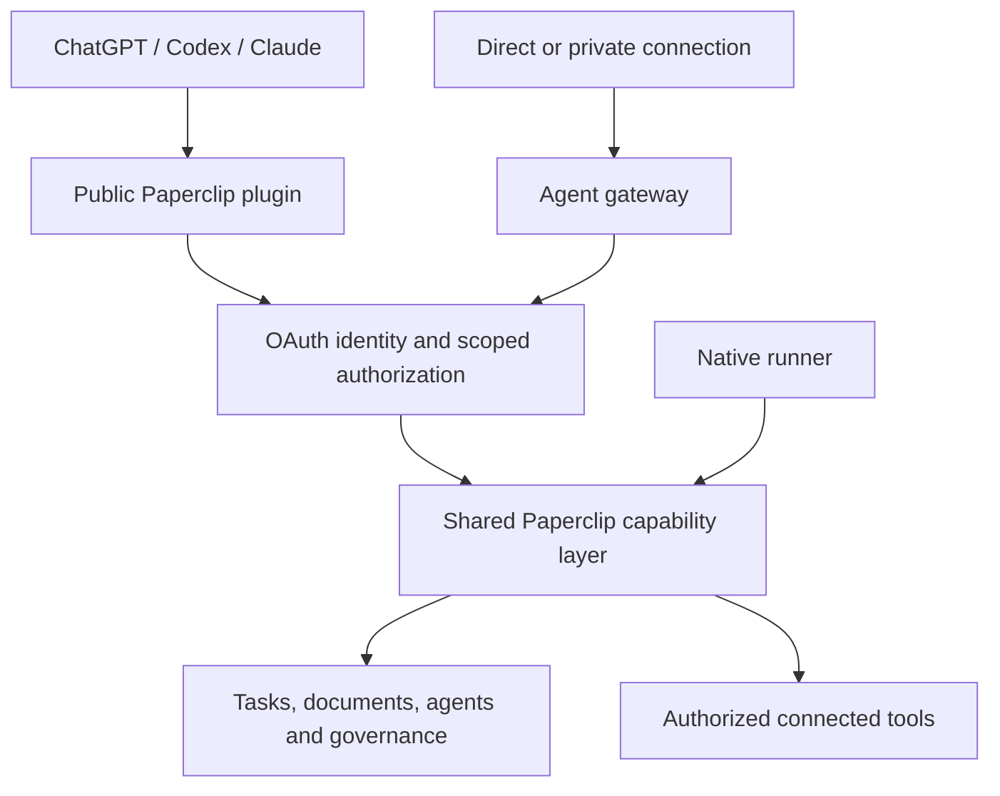

# Paperclip as the persistent team behind your assistant

Date: 2026-09-30
Status: First-release implementation in review; local paid acceptance verified across three models; deployment and hosted/store acceptance remain release gates

## 1. The thesis

**Paperclip should make a team's identity, tools, work, and governance available wherever someone uses an assistant.**

Codex or Claude can be where someone thinks and works. Paperclip supplies the persistent organization: who owns a task, which tools they can use, what happened, what needs approval, and what continues after the conversation ends.

| Layer | Responsibility |
| --- | --- |
| Paperclip core | Companies, agents, tasks, documents, execution, budgets, approvals |
| Capability and authorization layer | What this caller may do, under which identity and task context |
| MCP endpoint / gateway | Exposes those capabilities to outside clients |
| Plugin | Packages the connection with instructions for using Paperclip effectively |
| Team template | Creates a useful starting organization inside Paperclip |
| Store listing | Helps people discover and install the plugin |

A plugin brings someone into Paperclip and teaches their assistant how to work with it. The durable team and its authority remain in Paperclip. The first product is one Paperclip plugin that lets a person use their team, with hosted onboarding for newcomers. Broader agent gateways follow on the same foundation.

## 2. Three experiences

| Experience | Example | Identity and execution |
| --- | --- | --- |
| Use Paperclip as me | Show what's blocked and add my feedback. | Connected person's permissions and attribution. |
| Delegate to my team | Have our researcher investigate competitors. | Person creates work; Paperclip agent executes through normal scheduling and governance. |
| Work as an agent | This Codex session will work as our engineer on this task. | Explicitly authorized external session acts as the named agent and claims the task. |

Distinguish these in the connection UI and audit history. Selecting an agent to receive work never silently switches the caller into that agent's identity. An agent gateway is an access point to the agent's authorized capabilities. Its URL identifies the gateway; a separate credential authorizes access. Copying the URL alone confers no authority.

For eventual agent mode:

- Bind authorization to company, agent, consenting person, client, and granted capabilities.
- Preserve the effective agent identity and the person who authorized the session.
- Require an atomic, time-limited task claim. Native and external execution cannot both own a task.
- Recheck authority at invocation, including revocation, pause, reassignment, and approval gates.
- Expose only tools granted for external use; keep upstream credentials inside Paperclip.
- Provide task context and relevant instructions explicitly. Connecting MCP does not transfer conversation history or reproduce agent behavior automatically.

Paperclip governs participation. It does not promise to launch or stop the external client, observe every local action, or measure spending the client does not report.

## 3. Shared core, two MCP surfaces

Reuse existing named gateways, scoped context, hashed revocable credentials, tool profiles, policies, and connected-tool routing. Inbound gateway OAuth is currently reserved and disabled. Existing Paperclip self-tools are read fixtures, not a complete external API. Richer runner operations currently require an active native run with task ownership.

Extract reusable operation definitions and domain handlers incrementally. Public user connections, native runs, and external agent sessions get explicit authorization contexts. Preserve native execution checks; do not fabricate native runs for outside callers.

### Public plugin surface

Individually expose bounded Paperclip operations to:

- Identify the connected account and authorized company.
- List agents and projects.
- Search/read tasks, history, and progress.
- Create tasks with an assignee and add comments.
- Read task documents and deliverables.
- Inspect pending approvals and link to the existing decision interface.

Disclose scheduling/wake effects of task creation and comments. Background work returns a durable task reference immediately; later calls retrieve progress and output. Company selection is explicit and validated on every call, never shared mutable conversation state.

### Agent gateway surface

Later expose the agent's permitted Paperclip operations and third-party tools through direct/private connections. Reuse gateway policies, credential handling, approval records, and audit infrastructure.

OpenAI requires individually exposed operations for review and disallows hidden operations through discovery plus generic execution; it also restricts plugins primarily functioning as unofficial third-party intermediaries. Do not publish `search_tools`/`run_tool` or `search_api`/`call_api` as the public plugin's general interface. Delegation to Paperclip agents remains clearly disclosed product behavior with normal permissions and approvals. Store acceptance is subject to review.

## 4. Distribution and first use

Use one shared MCP implementation and shared workflow content, with vendor-specific packaging:

| Ecosystem | Packaging |
| --- | --- |
| ChatGPT and Codex | One plugin containing skills and a remote MCP connection, through the shared directory; current submission permits one connected MCP server per plugin. |
| Claude | Submit the server as a connector and the workflows as a plugin; pair them using the same server URL. |
| Direct/private clients | Configure an instance or agent gateway directly; private plugins optionally supply instructions. |

Maintain shared content with separate package outputs: OpenAI portable `plugin.json` and Claude `.claude-plugin/plugin.json`. Bundle three workflows: review my team, delegate work, follow up on results. Skills teach the workflow; server authorization enforces limits. Essential functionality requires neither hooks nor embedded UI.

Onboarding:

1. Discover and install Paperclip.
2. Connect through browser sign-in.
3. Choose an existing hosted team or enter hosted setup.
4. New users define a mission, select a template, and configure execution and spending.
5. Return to the assistant and delegate a first task.
6. Inspect progress and retrieve a concrete result.

Cloud owns stack provisioning. Reuse its onboarding flow and report readiness; installation alone must not create companies or start paid agents. Configure execution credentials separately from the client's Paperclip connection.

Use a stable Paperclip-owned HTTPS public endpoint. Resolve hosted instance access from the authenticated account and authorized company. Do not accept arbitrary instance URLs as tool destinations. Self-hosted users connect directly to reachable instances first; managed relays are deferred.

Implement OAuth with PKCE, resource/audience validation, discovery metadata, refresh/revocation, and registration compatible with both ecosystems. Outbound connector OAuth and inbound authorization remain separate responsibilities.

## 5. Delivery sequence and acceptance

### First release: use my team

Build public user-authorized MCP tools, hosted connection flow, shared skills, and both vendor packages. Support additive work actions; defer approval decisions, destructive administration, and external agent execution.

Prove:

- Connect an existing company and obtain an accurate summary.
- Delegate work with exactly one durable task and scheduled execution.
- Add feedback with correct human attribution.
- Retrieve a completed document/deliverable from a later conversation.
- Create a hosted team through onboarding and return to a working connection.

Verify isolation, roles, expiry/revocation, concurrent conversations, retry behavior, unknown mutation outcomes, paused/unavailable agents, and actual ChatGPT/Codex and Claude interoperability in addition to protocol tests.

### Second release: participate as an agent

Add explicit delegation and external task claims. Verify native-run contention, lease expiry, reconnect, pause, reassignment, and stale-session rejection. Clearly display external execution and unavailable usage accounting.

### Third release: bring granted tools

Expose approved connected tools through the agent gateway. Verify credential isolation, client-specific delegation, approval continuation, and immediate policy/revocation enforcement.

Defaults: one public listing, hosted onboarding, first-party public tools, broader direct/private gateways, and task-governed external participation. Specialized team plugins follow after the core connection and first task are reliable.

## Sources (researched 2026-09-30)

- [OpenAI plugin guidelines](https://developers.openai.com/plugins/plugin-guidelines)
- [OpenAI packaging](https://developers.openai.com/plugins/build/plugins)
- [OpenAI submission](https://developers.openai.com/plugins/deploy/submission)
- [OpenAI MCP deployment](https://developers.openai.com/plugins/build/mcp-server#deploy-the-endpoint)
- [OpenAI authentication](https://developers.openai.com/plugins/build/auth)
- [Claude publication](https://claude.com/docs/directory/publish)
- [Claude connector submission](https://claude.com/docs/connectors/building/submission)
- [Claude authentication](https://claude.com/docs/connectors/building/authentication)

## Initial implementation record (2026-09-30; historical)

Paperclip worktree: `paperclip-public-mcp`, branch `codex/paperclip-public-mcp`.
Cloud worktree: `paperclip-cloud-public-mcp`, branch `codex/public-mcp`.

At this initial checkpoint, the first-release code was in isolated branches and
broad verification had not passed. The failures below remain part of the history;
the later PR qualification record supersedes this checkpoint for current checks.
No production rollout has been performed.

Implemented:

- Opt-in `/mcp/paperclip` with ten individually exposed first-party tools.
- Company-scoped OAuth grants with S256 PKCE, exact redirect/resource validation,
  discovery, public client registration, hashed tokens, expiry, rotating refresh
  and revocation.
- Explicit browser team selection, optional writes, read-only role explanation
  and connection management.
- Request-local human authorization through existing REST/domain handlers;
  native run authority is unchanged. Instance admin status cannot elevate a
  connection beyond company-role permissions.
- Durable mutation receipts keyed by person, company, operation and request UUID,
  including retries under a new authorization grant; unknown outcomes require
  inspection.
- Shared review/delegate/follow-up skills and separate OpenAI/Claude packages.
- Cloud setup entry link using the existing configured Cloud origin.
- Companion Cloud branch `codex/public-mcp`: stable-resource OAuth broker,
  explicit organization selection, return from hosted creation, readiness UI,
  exact tenant protocol forwarding, and opt-in provisioning/release-roll config.
- Cloud grants retain tenant authorization through encrypted credential
  envelopes; current membership and verified domain/lifecycle routing are
  checked at forwarding. Durable request transitions guard concurrent selection
  and single-use code exchange. No arbitrary client destination is accepted.

Verification:

- Targeted PostgreSQL/protocol tests cover PKCE, redirect/resource binding, code
  reuse, refresh replay, expiry/revocation, role changes, company isolation,
  concurrent requests, retries and uncertain outcomes.
- Real task/comment/document route tests prove a single durable task, one call
  to the existing scheduling boundary, human feedback attribution and later
  document retrieval. Scheduling is captured; no paid agent is launched.
- Unavailable-assignee rejection is replayable, and assigning to a paused agent
  preserves its paused state and does not claim execution started.
- An isolated browser fixture exercised team selection, disabled writes for a
  viewer, explicit writes for an operator, consent/code exchange, cancellation,
  revocation and persisted state after reload. Its signed-in actor is a fixture;
  this does not prove a production sign-in or provider-client flow.
- Browser captures are retained outside the source tree as local verification
  evidence, rather than committed run artifacts.
- Codex package and all shared skills validate; UI token gates pass.
- Repository-wide typecheck and production build pass. The targeted boundary,
  logging, mutation-guard and company-route checks pass (91 tests).
- Subsequent MCP checks also pass with paused/unavailable assignees and a
  50,000-character non-ASCII body. Server compilation passes after the body-limit
  fix.
- Final focused checks pass together on Node 24.21.0: MCP, HTTP-log redaction,
  authorization, mutation guard, company routes and consent selection reset
  (158 tests in 6 files). The changed server/UI packages pass typecheck and
  production build; token gates pass. The protocol test also proves unexpected
  internal errors are not exposed and hosted setup uses Cloud's `/orgs/new` route.
- The full `pnpm test:run` is **not green or complete**. Its latest server group
  finished with 661 files passing, 9 failing and 3 skipped; 12,792 tests passed,
  8 failed and 104 were skipped. Failures included runtime-exposure assertions,
  refresh coalescing, agent/default configuration, and test/hook timeouts. The
  command exited before running subsequent groups.
- Separate runs of the remaining groups also did not produce a full green
  result: workspace group A had 610 files pass and 6 fail (6,259 tests passed,
  57 failed, including onboarding UI assertions and timeouts). Group B passed
  all 758 shared-package tests, then stopped at a skills-catalog package-build
  timeout. The serialized group stopped at its first suite's setup timeout.
  These failures are outside the new MCP tests, but have not all been proven
  pre-existing against a clean baseline. No unrelated assertions were changed
  to hide them. Full-suite triage and a complete green run remain outstanding.
- Isolated follow-up runs pass all 93 onboarding-wizard tests and both the
  refresh-coalescing and access-admin suites. The three runtime-exposure
  assertions still fail. A separate checkout at the unchanged starting commit
  `c65fc9e3c81c41aafe421aa90a00514b84343285` reproduces the same three failures on
  Node 24.21.0; baseline and branch were run sequentially to avoid competing for
  their fixed test ports. The baseline source was unchanged (only its local
  lockfile was regenerated because frozen install reports a pre-existing
  patched-dependency configuration mismatch). This establishes those three
  failures as baseline behavior; it does not clear the other broad-run results.

Open gates at the initial checkpoint:

1. Resolve the broad Paperclip verification failures above, finish all required
   test groups, and complete normal code/PR review. No PR has been opened.
2. Deploy compatible instance and Cloud releases, migrations, a broker key from
   the secret store, and the explicit feature opt-ins. Roll existing/pool stacks
   onto the compatible tenant version. No production deployment has been made.
3. Build packages against the deployed stable Paperclip-owned HTTPS endpoint and
   provide store review metadata; checked-in packages target loopback development.
4. Exercise ChatGPT/Codex and Claude application/store installation against the
   staging HTTPS endpoint and run a controlled agent through execution to a
   completed deliverable. Local CLI OAuth and MCP SDK interoperability tests
   are distinct from hosted application/store verification.
5. Prove the live hosted newcomer journey from the existing signup eligibility
   policy through mission/template and spending setup back to consent. Automated
   creation-return tests do not open signup or configure paid execution.

Cloud verification added during implementation:

- Broker protocol and service tests cover PKCE, audience/redirect binding,
  concurrent exchange, current membership, wrong tenant identity, refresh replay,
  expiry, revocation, CSRF and protocol forwarding without Cloud user headers.
- The PostgreSQL test ran against a disposable database: migration, restart
  durability, two-store compare-and-swap and expired request cleanup passed.
- The full Cloud UI suite passed (85 files, 643 tests), typecheck and build passed.
- After the final consent reset change, the connection and creation-return
  suites passed again (22 tests, including one additional regression case).
- A real MCP SDK client completed initialization, discovery of all ten tools,
  and a connection call through the Cloud broker into the real tenant OAuth/MCP
  server. Person/company attribution, refresh and revocation passed. This caught
  and fixed a redirect-validation mismatch with tenant request IDs.
- Actual Codex CLI 0.153.4 and Claude Code 2.1.245 completed dynamic client
  registration and PKCE OAuth login through the Cloud broker into the tenant
  OAuth implementation. These used disposable local databases and a fixture
  person with explicit read-only test consent; they did not use production
  sign-in, a public listing, or paid model execution. Claude's terminal login
  was exercised through a PTY. Both clients' fixture credentials were logged
  out and the temporary Claude server configuration was removed.
- The complete Cloud backend suite passed on its specified Node 22 runtime:
  1,236 passed, 23 skipped, zero failed or cancelled. The opt-in PostgreSQL test
  was also run separately and passed. Cloud's `smoke:qa` passed, covering the
  signup/portfolio/entry, isolation, routing and sleep/wake boundaries.
- A local browser walkthrough explicitly created one organization, returned to
  the pending connection, selected the ready organization, and verified its
  persistence after reload. Selection resets until chosen again. This used a
  fixture account eligible under existing signup policy and a fake provisioner;
  it does not prove production provisioning, a real external client's login,
  mission/template setup, or paid-agent execution.

Release two (external agent participation/leases) and release three (granted
third-party tools) remain future work, as sequenced above.

## Paid evaluation campaign

The user requested paid LLM evals across several models, beginning with cheaper
models. Implement these in the existing Product E2E catalog and report pipeline,
as the explicit-only `public-mcp` suite. The maintained runbook is
`tests/runner-e2e/PUBLIC-MCP.md`.

- Exercise seven scenarios: delegate/retrieve across conversations, uncertain
  mutation retry, team review, human feedback, read-only connection, untrusted
  document/company isolation, and paused-agent queuing.
- Use the actual browser consent UI, inbound OAuth, MCP SDK, paid assistant API,
  scheduler and paid CLI worker. Grade independent persisted API state and keep
  positive/negative/missing-evidence oracle calibrations.
- Start with GPT-5.4 Mini and Claude Haiku 4.5, then Claude Sonnet 4.6. A cheaper
  Nano pilot called the public tools successfully but its Codex worker rejected
  an unsupported `tool_search` capability; retain this compatibility failure.
- Preserve failed attempts, explicit model/profile IDs, source and skill digests,
  token usage, separate external-assistant estimates, worker charges and cleanup.
  Do not infer hosted/store readiness from a local paid workflow.
- Run narrow pilots before the complete 21-cell selection; fix product/harness
  failures, retain model failures, and repeat the final model matrix to check
  that success is not a single lucky run.

Initial paid qualification (2026-10-01): **42/42 cells passed** across two complete
21-cell runs on identical source, without retries. GPT-5.4 Mini, Claude Haiku 4.5
and Claude Sonnet 4.6 each passed all seven cases twice. All 42 packaged evidence
sets passed the existing validator. Eval typecheck and 470 unit tests pass; the
focused MCP and Cloud broker checks also pass (11 and 8 tests respectively).

The iterations improved real tool/workflow instructions for resolving task and
company IDs, clarified generic document creation in the production worker skill,
and calibrated the independent oracles for schema repair, paused-task recovery
and untrusted-document causality. Original failed grades remain in the reports.
The [dated results record](2026-10-01-public-mcp-paid-eval-results.md) includes
source fingerprints, models, costs, reports, failure classifications and the
remaining hosted/store and repository-wide verification gates. These local paid
results do not close those release gates.

## PR qualification and merge consequences (2026-10-01)

[Core PR #14846](https://github.com/paperclipai/paperclip/pull/14846) contains the
instance implementation, plugin packages and evals. The companion Cloud PR is
tracked in the Cloud repository. Both use fresh worktrees and dedicated branches;
neither has been merged or deployed by this work.

After rebasing onto the current development baseline, the Core CI run at
`fb7946a4b82d6010dfaa24cb2f81e8fef72fd779` passed all actual CI lanes, including
server/workspace/serialized tests, all eight browser shards, typecheck and build.
Subsequent review fixes repeat CI before handoff; each PR's Verification section
and latest-commit checks are the current record. The initial local broad-run
failures above are retained as historical evidence, not a claim that current CI
is failing.

Current local qualification:

- Core production build, repository-wide typecheck, eval typecheck and all 881
  eval-support tests pass. All 15 real OAuth/MCP tests and 10 OpenAPI checks pass.
- Shared registration and pending-consent quotas are enforced in durable state.
  Completed connections do not exhaust a shared client's pending quota. Tests
  complete twelve connections for one client and exercise concurrent admission.
- Cloud root tests pass: 2,074 passed and 63 opt-in tests skipped. Web tests pass:
  769 tests in 93 files. Root/web typechecks, web build and smoke QA pass.
- Seven opt-in durable PostgreSQL tests pass, including cleanup/admission races,
  shared quotas, active-client retention and repeated completed connections.
- The latest Core and Cloud code passes a real OAuth/broker/MCP SDK round trip:
  initialize, list ten tools, call, refresh and revoke with person/company
  attribution preserved.
- A fresh paid complete matrix after rebase and review fixes passes 21/21, with
  no retries and all evidence packages validated. This follows two earlier
  21/21 campaigns. The final pending-consent correction has dedicated protocol
  tests and a 3/3 paid delegation/retrieval regression, one on each model, with
  no retries and all evidence validated. See the dated results record for the
  exact source fingerprints and costs.

This is a usable opt-in first release for existing teams. Applying Core updates
adds migrations 0301 through 0305 plus disabled MCP code. An operator must enable
**Settings → Experimental → Assistant connections (MCP)**, configure the public URL, and expose the
authenticated instance over HTTPS. A team member can then connect Codex or Claude
Code directly, consent to a company, review work, delegate tasks as themselves,
and retrieve results later. [The runbook](../public-mcp.md) includes commands.
The shared production Paperclip skill also gains generic document-creation and
read-back guidance.

Hosted use additionally requires Cloud migration 0055, a secret-store encryption
key, the Cloud feature flag, and a compatible tenant release/fleet rollout.
Signup eligibility, execution credentials and spending setup remain explicit.
Merging does not create a company, launch paid agents, expose a live public
endpoint, or publish a store listing. Actual hosted newcomer provisioning,
staging HTTPS application connections and public store installation remain
release gates. Agent impersonation/external task claims and third-party tool
access remain releases two and three.

## MCP Events addition (2026-10-01)

Add user-requested task monitoring using [OpenAI MCP Events](https://developers.openai.com/plugins/build/mcp-events), alongside the existing legacy MCP tool transport. Implement MCP 2.0 (`2026-07-28`) discovery and individually described task status, comment and document events. Start with an explicit company and task filter; monitoring never grants agent identity or approval authority.

Subscriptions and pending deliveries persist in PostgreSQL. Callback ownership verification and event deliveries use Standard Webhooks signatures, encrypted signing material, HTTPS with pinned public-address resolution, finite lifetimes, bounded retries, and current authorization checks. Hosted delivery additionally checks Cloud account/stack membership through its fixed broker, with a subscription lifetime bounded by its authorization proof. No replay cursor is advertised in this first implementation; use task/history tools to recover missed work after an expired subscription.

Add restart, retry, isolation, revocation, callback verification and protocol compatibility tests. Extend the existing paid evaluation infrastructure with event-driven follow-up across the qualified models, retaining source/cost/evidence. A real ChatGPT Work Cloud subscription and plugin rescan against staging remain rollout acceptance gates until exercised. Claude and older clients retain tool-based follow-up.

Implementation and paid verification are complete for this addition: the three-model event-follow-up selection passed, followed by a Mini regression on the final quota/status changes. All evidence validates. The updated [results record](2026-10-01-public-mcp-paid-eval-results.md#mcp-events-qualification) retains the source fingerprints, setup failures, costs and remaining client rollout gates. Core persists finite subscriptions and signed deliveries; Cloud forwards MCP 2.0 metadata and preserves current hosted authority. Deployment and actual ChatGPT Work Cloud acceptance remain separate steps.

## Experimental setting (2026-10-02)

Replace the instance environment enable flag with the persisted `enablePublicMcp` experimental setting, off by default. Administrators toggle Assistant connections (MCP) without restarting. Recheck the setting for OAuth, tools, subscriptions and webhook delivery, while retaining connection revocation when disabled. Keep canonical public URL and the shared Cloud broker deployment configuration separate from tenant consent. Update direct-client setup and paid fixtures to use the same settings API as the UI.
