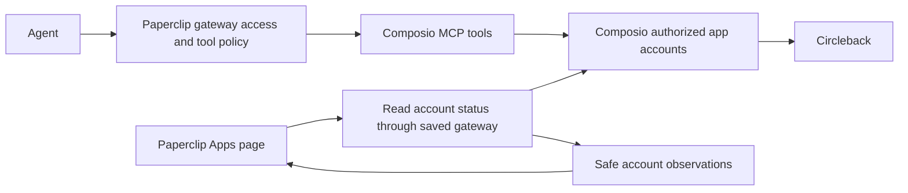

# Composio connections and permissions in Paperclip

October 2, 2026 · Current behavior and proposed product model

**Composio should be the source of truth for its app accounts. Paperclip should show those accounts and control who can use the saved Composio connection.** Connecting Circleback in Composio should not require connecting it again in Paperclip when the saved gateway can already reach that account.

The current integration supports direct app authorization and checking known accounts, but discovery is incomplete. Its Circleback cards also look like independent Paperclip connections even though their permissions belong to the entire Composio gateway. This document explains that distinction and proposes a clearer experience. Recommendations below are proposals; this document does not change product behavior.

## What the saved connection actually represents

The default integration uses Composio Connect at `https://connect.composio.dev/mcp`. Composio describes this as one MCP connection that discovers and executes tools across apps through orchestration tools. It is different from an application creating its own Composio SDK session. [Composio Connect documentation](https://docs.composio.dev/docs/composio-connect)

There are three objects to distinguish:

| Object | Meaning |
| --- | --- |
| Saved Composio connection in Paperclip | An endpoint, credentials, access rules, and tool catalog. We have called this a gateway. Multiple saved Composio connections are possible. |
| Connected app account in Composio | A particular authorized Circleback, Spotify, or other app account. |
| App row in Paperclip | A cached observation of an account available through a saved gateway, plus a convenient setup or management entry point. |

**An observed Circleback row does not create another credential or independent connection in Paperclip.** The public app catalog is another separate thing: it says Composio supports Circleback, without proving that this gateway has an authorized Circleback account.

Composio accounts are scoped. Projects separate resources, and connected accounts belong to an upstream user identity. Dashboard-created accounts use a Composio dashboard user identity, which is different from an application's `user_id`. Matching a person's email or using the same Composio brand is insufficient to establish that two integrations reach the same accounts. [Project isolation](https://docs.composio.dev/reference/api-reference/projects), [Connected account identities](https://docs.composio.dev/reference/api-reference/connected-accounts)

For our existing Connect gateway, the practical question is: **Does listing Circleback through this exact saved credential return the account?** That check is stronger evidence than seeing Circleback somewhere in the Composio dashboard. The current integration has not established a general mapping from Connect OAuth identity to every dashboard project.

## What happens to tools

Paperclip does expose the gateway's tools to permitted agents. It reads the upstream MCP `tools/list`, stores the returned definitions, presents eligible tools through its own runtime, checks policy, and forwards execution to the saved endpoint using server-resolved credentials.

That is a proxy of the upstream tool catalog. It does **not** turn every app in our public catalog into its own set of executable Paperclip tools.

The live test gateway currently has 11 active Composio catalog entries, including search, schemas, connection management, batch execution, and workbench tools. It does not list a separate Circleback tool set. Circleback execution happens behind those Composio tools. A custom session endpoint could expose a different catalog; the actual upstream definitions determine what Paperclip presents.

Consequently, an account can be available for execution even before the Apps page discovers it. The account snapshot is a display cache, not an execution allowlist.

## What currently works and what is incomplete

These findings come from the current worktree and a read-only check of the local test gateway.

| Capability | Current behavior |
| --- | --- |
| Reuse an already connected app | Setup lists the requested toolkit first. An active account skips creating another authorization link. No agent task is necessary. |
| Authorize an app from Paperclip | The backend requests a hosted Composio authorization link. Completion checks account status again. |
| Recognize a known account | Safe account IDs, aliases, statuses, default flags, and check times are cached. A fresh check confirmed Circleback is active. |
| Discover an app connected independently | The Apps page checks its visible catalog toolkits and previously observed or configured toolkits. A previously unseen app can remain undiscovered until its page or search is checked. |
| Notice external disconnection | Rechecking a known toolkit replaces the observation with the provider's returned account list. Until then, the card can be stale. |
| Rename or remove an app account | Paperclip calls Composio, then lists accounts again to confirm the change. This changes upstream state. |
| Give Circleback its own agent permissions | The row's Permissions action opens the saved Composio gateway's permissions. It is not an independent Circleback permission boundary. |

Refresh happens on page entry, changes to the visible catalog query, and browser focus. The one-minute query freshness setting is **not** a background polling schedule. We have no full inventory reconciliation job or lifecycle webhook integration here.

If a provider check fails, we preserve previous observations and show an error. That avoids interpreting a failed request as a disconnection, but the old green check can still look current. The UI should distinguish **last confirmed connected** from **verified now**.

Two additional presentation gaps matter:

- Native connector precedence currently excludes overlapping aggregator cards altogether. A native Notion offer can therefore hide the fact that Notion is already available through Composio. We should suppress duplicate connection offers while still showing real upstream accounts and their source.
- The aggregator row's “Connected by” identity comes from the saved gateway owner metadata. It does not establish who authorized the app independently in Composio. Preserve the account-row visual style, but use truthful attribution such as **Via “Work Composio”** unless the upstream author is known.

## Who owns which permissions

| Question | Authority |
| --- | --- |
| Is this app account authorized and active? | Composio, backed by the app's authorization. |
| What access did the app's OAuth consent grant? | The app and Composio's authorization configuration. |
| Can this Paperclip human or agent use the saved gateway credential? | Paperclip's grants and access controls. |
| Is this exposed MCP tool allowed, denied, or subject to approval? | Paperclip's tool policy. |
| Can this agent use only Circleback through a broadly enabled Composio executor? | Not established by the Circleback app row or its current Permissions link. |

New gateways now default to all humans and all agents. That makes the gateway available to those actors; it does not override credential requirements, tool policies, or Composio's own account restrictions. App setup preserves the saved gateway's existing rules.

The policy system evaluates the catalog entry being invoked. For example, it sees `COMPOSIO_MULTI_EXECUTE_TOOL`; it does not automatically expand every nested app action into a separate Circleback permission decision. The current integration has no Composio-specific layer that grants or denies downstream toolkit/account operations independently.

An approval for a broad execution tool is therefore an approval for that call and its arguments. It should not be presented as a verified per-app read/write policy. Generic argument rules can constrain particular shapes, but do not by themselves provide comprehensive app isolation across batch execution and workbench paths.

Likewise, an app card's absence, a native app's precedence, or removing a cached observation cannot stop a permitted gateway from reaching an upstream account. A visual catalog choice is not a runtime restriction.

## What connecting or disconnecting elsewhere should mean

The following is the proposed behavior, assuming the account belongs to the identity and scope reachable by the saved gateway.

| Event | Expected Paperclip behavior |
| --- | --- |
| Connect Circleback in Composio | Import it into connected apps automatically. No second OAuth flow or local activation step. |
| Click Connect when Circleback is already active | Verify and show the existing account. Do not create another account. |
| Disconnect Circleback in Composio | Update the account row after reconciliation. Provider execution follows upstream state even while our card is stale. |
| App authorization expires | Show Needs sign-in and offer the provider's reauthorization flow. |
| Composio cannot be reached | Keep the last observation, mark it stale, and show Check again. Do not claim a confirmed disconnection. |
| Add a second account for the same app | Show both accounts. Do not imply that clicking one pins all later agent calls to it unless execution actually enforces that choice. |
| Remove Composio from Paperclip | Remove local access to that saved gateway. Keep upstream app accounts in Composio. |

Composio documents automatic OAuth token refresh and an expired-account event. That gives us one potential sync signal, but does not prove that our Connect credential can subscribe to every creation, deletion, or status event. [Authentication lifecycle](https://docs.composio.dev/docs/authentication)

## The experience I recommend

**Keep one saved connection per Composio account or configured endpoint, show its apps as imported accounts, and manage app authorization in Composio.** This matches the underlying system and keeps our interface small.

1. **Connecting Composio imports its available accounts.** Put them above the catalog using the same divider, check, logo, and account-row layout as other connections, with a Composio badge and quoted gateway name. Label this inventory as connected apps, rather than apps separately installed into Paperclip.
2. **Connect asks which saved Composio account to use, or offers a new one.** Check existing authorization first. If needed, open a provider-generated sign-in link directly and verify the result. No agent picker or task draft.
3. **An app's Manage action shows its accounts and opens Composio management.** Prefer a toolkit/account-specific URL where supported and verified; otherwise link clearly to Composio. Do not promise a deep link that the provider does not expose.
4. **Permissions live on the Composio gateway.** From an imported app row, call the action **Composio permissions** and explain once that changes apply to apps accessible through that gateway. Keep native connector permissions independent.
5. **Manage upstream app removal in Composio for the initial model.** Reserve **Remove connection** in Paperclip for removing the saved gateway locally. If we retain direct upstream removal, name it **Disconnect from Composio** and explicitly say it can affect other clients using that account.

This is a UX recommendation, not a technical inability to remove accounts. Composio Connect supports account creation, listing, renaming, and removal, and our backend already implements those operations. [Connection management capabilities](https://docs.composio.dev/docs/composio-connect)

Removing an account from Composio should also not be described as guaranteed revocation of the target app's OAuth grant. Composio distinguishes removing an account from revoking its authorization at the provider. [Connected account lifecycle](https://docs.composio.dev/reference/api-reference/connected-accounts)

For native overlaps, keep the native Connect offer as requested, but include actual Composio accounts in the connected inventory with their source visible. A Composio account should never silently become a native account.

## How to make discovery complete

The current per-toolkit checks are useful, but cannot support the promise “we automatically import everything you already connected.” Scanning thousands of catalog toolkits is an expensive substitute and can still miss apps absent from our public catalog.

Composio provides a paginated connected-account API with project-key authentication and user/toolkit/status filters. Its SDK also offers paginated session toolkit discovery filtered to connected apps. These are better building blocks for inventory than probing every public catalog entry. [Connected-account API](https://docs.composio.dev/reference/api-reference/connected-accounts/getConnectedAccounts), [Session inventory](https://docs.composio.dev/docs/configuring-sessions)

**The unresolved integration question is whether we can enumerate that same inventory using the identity behind our current Connect OAuth gateway.** We must not assume that credential is a project API key or that a dashboard project's users match it. Listing every account in a project without the correct identity filter would not answer the user's question.

Proposed implementation order:

1. Establish a supported inventory API for the saved credential, including its upstream subject, project/session scope, and shared-account semantics. If Connect cannot provide this, evaluate an explicit project/session integration as a separate setup mode.
2. Reconcile every inventory page on connection completion and refresh; add bounded background reconciliation and supported event notifications. Events trigger another authoritative read rather than becoming a second source of truth.
3. Store only safe metadata, scoped to company, gateway, and resolved credential identity. Preserve last-success time and sync errors. Change credentials or upstream identity without carrying over another identity's connected status.
4. Reconcile removals only after a complete successful listing. Partial pages and failed calls must not delete unseen accounts. Surface unknown custom apps using provider metadata where available.

Until the identity-bound enumeration route is proven, describe the current display as **apps checked through this connection** rather than complete synchronization. The current cache uses a credential-reference fingerprint; that is not proof of the upstream user's identity.

## If we later want independent app permissions

We should decide this separately from inventory. The simpler gateway model is valid, provided the interface is honest about its scope.

Composio SDK sessions can restrict toolkits, tools, and selected connected accounts. A session MCP endpoint can use those restrictions and a direct-tools preset to expose an explicit tool set. That offers a possible route to enforced per-agent scope, but it requires a different integration contract from merely observing accounts behind Connect. [Session configuration](https://docs.composio.dev/docs/configuring-sessions), [Session MCP endpoints](https://docs.composio.dev/docs/sessions-via-mcp)

The other route is a Paperclip executor that validates every downstream tool and account and prevents broader execution paths from bypassing those rules. This is substantial runtime work. Adding a per-app toggle while leaving unrestricted gateway execution available would not establish the promised boundary.

For apps already supported natively, a native connection remains the clearest way to apply that connector's individual access controls.

## Evidence and checks still needed

The local gateway returned 11 active Composio tools, and a fresh read through our app refresh endpoint confirmed an ACTIVE Circleback account. This proves account-status checking for that saved credential. It does not prove all-app enumeration, a successful Circleback business operation, external lifecycle synchronization, or independent Circleback permissions. No real account was disconnected or permission changed for this document.

Before claiming complete sync, demonstrate an app connected independently in the matching Composio scope appearing without searching for it; then externally disconnect a disposable test account and verify both the UI and execution outcome. Also check account isolation, multiple-account selection, provider failures, native overlaps, and gateway removal without upstream account deletion.

Implementation evidence in this worktree:

- `server/src/services/tool-access.ts`: `openComposioGateway`, `setupComposioApp`, `refreshComposioApps`, and `manageComposioAppAccount` implement checks, safe observations, and upstream mutations.
- `server/src/services/tool-gateway.ts`: `policyInputForAgentTool` and remote MCP execution show the tool-policy boundary and forwarding of catalog tool names and arguments.
- `server/src/services/tool-access-policy.ts`: catalog entries and saved connections determine the policy context; no automatic downstream Composio app expansion is implemented.
- `ui/src/pages/apps/Browse.tsx`: native precedence, page-based discovery, connected-account rows, permission links, and owner attribution.
- `packages/db/src/schema/tool_connection_app_snapshots.ts`: cached account observations, separate from connection grants.
- `doc/connections/CONNECTOR-PLAYBOOK.md`: the current aggregator catalog and setup behavior.

The recommendation is to adopt the provider-owned account model now, then prove complete discovery before promising it. Independent app permissions can follow if we choose to build and enforce them.
