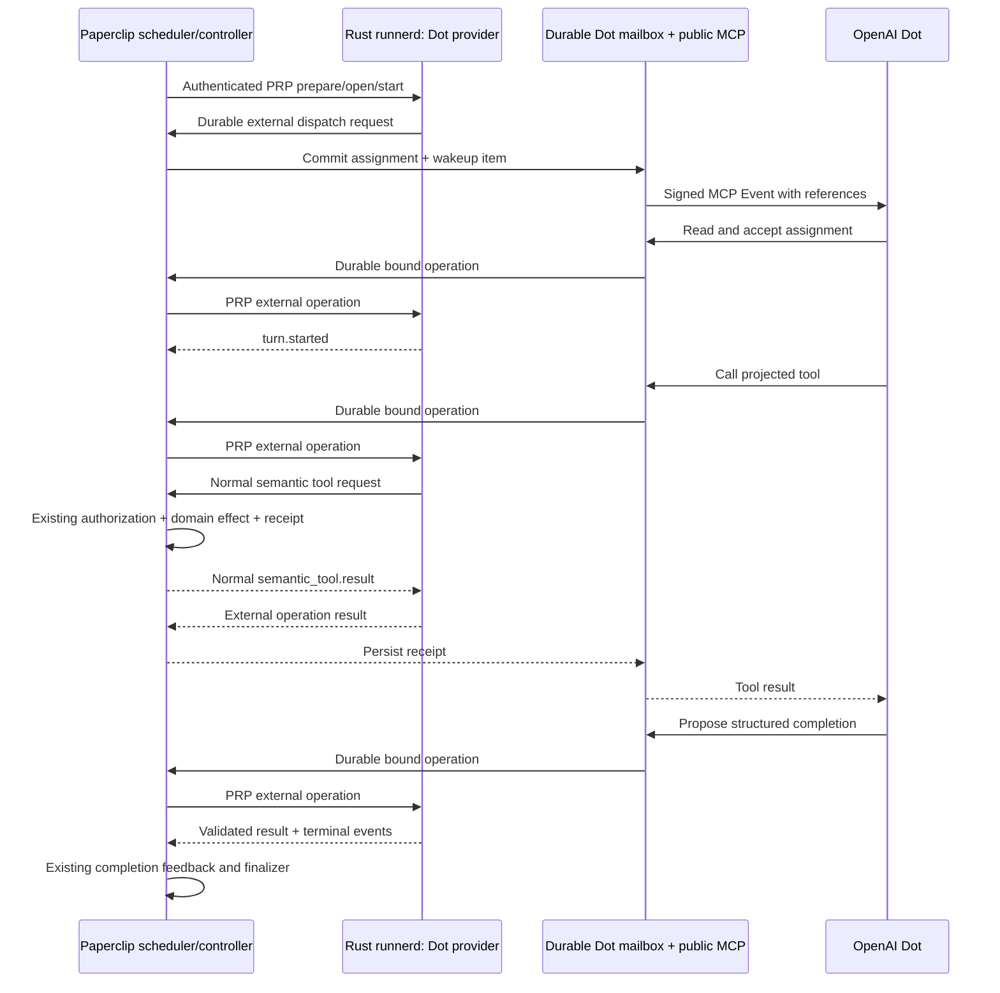
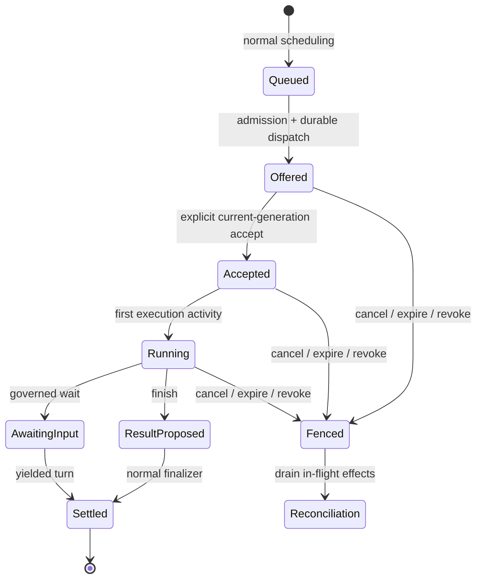

# OpenAI Dot as a production Paperclip Runner provider

Date: 2026-10-02

Status: Experimental self-hosted adapter and full Runner extension implemented; real-account qualification and remaining limits are recorded in the dated checkpoints below

Branch: `codex/dot-events-prototype`

Scope: Original production design with the implementation status recorded below. The adapter remains off by default.

## Implementation status

Implemented the dedicated agent OAuth resource, one-use pairing and readiness
challenge, scoped durable mailbox and operation receipts, PRP v3 external
operations, native input v6 without a workspace or credentials, Rust Dot
executor, normal task tool/completion authority, provider configuration and
connection UI. Tests exercise the real Rust Runner and ordinary task status
finalizer, plus bridge reattachment and missing-checkpoint refusal.

The current supported deployment is self-hosted with a local controller and
stable public HTTPS. The October 7 real-account checkpoint qualifies the dedicated `/mcp/runner`
path. The earlier account proof covered only the reference harness transport. The complete fault matrix and hosted agent-broker
qualification below remain future qualification work.

The original adapter rejected assigned skills and third-party MCP bindings.
The user subsequently authorized their governed Runner integration. The full
extension now reads pinned skill files and relays assigned gateway tools.
Workspace files and sandboxed commands require an explicit per-agent opt-in.
Automatic inbound attachment staging remains disabled pending separate scope
approval. See [the adapter runbook](../openai-dot-runner.md).

## 1. Recommendation

Add **OpenAI Dot** as a provider of the existing `paperclip_runner` adapter:

```json
{
  "adapterType": "paperclip_runner",
  "adapterConfig": {
    "provider": "openai_dot",
    "dotBindingId": "<server-owned binding>",
    "lifecycleMode": "per_turn"
  }
}
```

The provider uses MCP Events to notify an existing Dot and authenticated MCP
tools to receive its actions. Rust `runnerd` owns the provider state machine and
PRP lifecycle. Paperclip owns connection authorization, durable mailboxes,
admission, tool effects, budgets, approvals, and final task disposition.

The implementation is a new Runner provider, not a new legacy `execute()`
adapter. Keep `paperclip_runner` in the server/UI/CLI registries. The older
`create-agent-adapter` skill remains useful for configuration, diagnostics and
cross-surface consistency; its process-spawning package recipe does not define
this provider's execution architecture.

The branch now integrates the merged public MCP foundation (`e34abee67`,
#14846) and scoped browser/device assistant invitations (`22a3ea341`, #14933)
from master. The preliminary foundation at `a88448f77` is superseded.
This does not imply that the companion Cloud broker is deployed or qualified.

### Gateway reconciliation — 2026-10-06

The canonical worktree remains `dot-events-prototype/paperclip` on
`codex/dot-events-prototype`. Master was merged through `c365a16e3`.
The shared consent implementation now creates distinct agent-purpose grants
for both browser and device flows, validates request resource and organization
ownership, and rejects viewer approval. Dot has a separate issuer and scope.
Verified client metadata, durable verification quotas, event secret rotation,
subscription refresh races and warm-standby gates use the merged implementation.
Personal and Dot event workers consume their own subscription resources.

The generated Dot-only migration is now `0317_messy_famine.sql`, after the
published master migrations. Its table, column, index and constraint additions
are safe to reapply. Both consent UIs retain the merged organization branding
and request layout while explaining agent access. Runner provider selection
uses the current shared harness selector.

Targeted gateway, Dot, onboarding and UI verification passed 125 tests before
the added migration replay check. Full workspace typecheck/build and token
gates passed. Runner recovery verification passed 123 tests and the Rust
workspace passed 318 library tests. The local full repository attempt was
stopped after 2 hours 47 minutes when review fixes made it stale. Final branch
CI and review are tracked in [PR #15402](https://github.com/paperclipai/paperclip/pull/15402);
the adapter runbook records verification limits.

The other gateway chat's subsequent assistant-tool expansion is still separate
work and is not part of this integration. Real-account qualification of the
dedicated Runner endpoint remains outstanding. Assigned skill files and
third-party MCP bindings remain unsupported.

### Evidence and limits

The real-Dot test on October 2 demonstrated:

1. Private custom-plugin installation and ordinary OAuth connection.
2. Dot successfully calling `paperclip_connection`.
3. A verified MCP Events subscription and signed webhook delivery.
4. Dot fetching and accepting an assignment without a second chat prompt.
5. Dot invoking a projected tool and saving exactly one test report.
6. A valid structured result, native `turn.completed`, and `run.terminal` with
   state `succeeded`.
7. Server-confirmed unsubscription.

The native test used TypeScript `HarnessDriverBackend`, synthetic admission,
an in-memory driver registry and one synthetic tool. It did not exercise Rust
runnerd, normal task checkout/finalization, restart recovery, usage accounting,
or workspace execution. Those are implementation requirements below.

The test also exposed two onboarding details: action tools may become available
after their directory listing appears, and restarting a disposable lab destroys
OAuth state. A stable deployment and a real readiness check are essential.

## 2. Product contract

### Paperclip initiates work

A user selects **Paperclip Runner → OpenAI Dot**, connects their Dot, and assigns
it an ordinary task. Existing scheduling admits the task. Paperclip sends a
small event; Dot retrieves the current assignment, explicitly accepts it, uses
the projected tools, and submits its result. The task thread shows delivery,
acceptance, progress, outputs, and completion separately.

Paperclip can enqueue work whenever its ordinary rules allow. Delivery and
execution are asynchronous. A webhook acknowledgement is never presented as
proof that Dot started work.

### Dot initiates interaction

Preserve both directions and make the acting identity explicit:

| Context | Authority | Supported behavior |
| --- | --- | --- |
| User asks their Dot to use Paperclip | Existing personal MCP connection | Read company work, create/delegate tasks, add feedback, retrieve results; actor is the consenting person. |
| Dot executes an assigned Runner turn | Dedicated agent connection plus admitted assignment | Invoke the same authorized semantic tools as another Runner provider; actor is the assigned agent and run. |
| Dot wants to start work while idle as the agent | Dedicated connection's `request_work` operation | Submit a bounded wake request referencing an authorized task and intent. Normal scheduling decides whether to admit a run before exposing its mutation tools. |

Idle `request_work` must support a company-scoped planning/intake task for
agent-initiated ideas, so proactive work does not depend on an already assigned
engineering task. The intake task is an ordinary governed work object, created
through existing task rules; it is not the event mailbox or an execution bypass.
Actual task creation, delegation and writes then use the admitted tool catalog.

Do not silently give an agent the consenting person's authority. A personal
connection remains optional and independent. If the same Dot also has personal
Paperclip access or other plugins, Paperclip cannot prevent it from acting
through those separately authorized channels. Users needing strict separation
must use a Dot/account without those broader connections.

### First release boundaries

- One active assignment per binding. Additional tasks remain in normal queues;
  do not admit a large backlog into provider sessions waiting for acceptance.
- One active agent binding per dedicated OAuth grant. Multi-agent multiplexing
  through one Dot connection is deferred.
- Standard, planning and ask tasks use normal Paperclip tool policy. Only
  capabilities actually exposed to this provider are offered.
- Start with control-plane work: research coordination, task decomposition,
  documents, comments, approvals and assigned connector tools. A Dot is not
  presumed to share the Paperclip repository or local filesystem.
- Follow-up messages are durable task messages and subsequent assignments.
  Active steering is unavailable in v1. The UI must say when a message is queued.
- Model selection, token usage, provider-native session reset, private reasoning,
  global interruption, and control of Dot's other tools are unavailable.
- Public reachability is required. No Chrome automation, ChatGPT cookies,
  undocumented task endpoints, or expiring development tunnels in production.

## 3. Architecture and ownership



The apparent round trip through the controller is intentional: MCP is the
provider's transport, while Runner remains the execution lifecycle. Avoid a
second tool dispatcher or finalizer hidden in the MCP route.

### Component responsibilities

| Component | Owns | Must not own |
| --- | --- | --- |
| Public MCP/OAuth | Authenticate each call, resource/scope checks, bounded input, callback verification | Creating an admitted run from supplied IDs; arbitrary agent impersonation |
| Dot broker in server | Pairing, bindings, mailbox, delivery state, request deduplication, routing to the current controller | Domain effects or provider terminal decisions |
| Rust Dot provider | Turn acceptance, provider command ordering, projected-call mapping, durable provider receipts, PRP events and checkpoints | DB access, company policy, OAuth secrets, issue status writes |
| Existing native controller | Admission, PRP ownership/leases, semantic dispatch, governed waits and finalization | Pretending a webhook receipt proves execution |
| Dot | Retrieve work, perform reasoning, invoke exposed tools, propose result | Selecting its company/agent/run authority or bypassing finalization |

Runner receives no ChatGPT credential, MCP OAuth token, webhook URL/signing key,
or unrestricted Paperclip API key. Reuse the authenticated PRP connection for
the app-owned broker port. Do not add a second generic HTTP control API solely
to get operations into runnerd.

The Runner package remains standalone: define the broker port and envelopes in
the package; implement them in Paperclip server without importing server or DB
code into `packages/paperclip-runner`.

## 4. Production Runner integration

### Provider identity and configuration

Proposed identifiers:

- Provider: `openai_dot`.
- Driver: `openai_dot_mcp`.
- Execution kind: `remote_service`; the local runnerd process is only the
  controller-side transport, not the Dot's execution process.
- Service: `openai_dot`.
- Provider session ID: `null` unless a documented provider identity becomes
  available. A user-entered Dot URL is a display link, not authentication.
- Model: `null`, displayed as **Managed by Dot**.
- Provider version: our qualified bridge/protocol revision, clearly labelled;
  do not claim it pins OpenAI's hosted implementation.

Agent config contains only binding references and validated operational limits.
The server resolves the binding into an immutable per-run snapshot containing
company, agent, connection, binding generation, catalog revision, deadlines and
protocol revision. Tasks cannot override that identity or supply callback URLs.

### Contract changes

The current native input is a closed `paperclip.native-execution-input.v5`
contract. Introduce the next input revision with a Dot provider variant; retain
v1–v5 parsing and recovery for existing providers. Update JSON Schema,
TypeScript and Rust together, plus export/compatibility manifests and fixtures.
Do not repurpose a Codex or ACPX profile.

The new input must also distinguish provider workspace access from the Runner's
own state directory. Dot's workspace-access variant is `none`; it receives no
provider cwd. Adapt the execution-input builder and filesystem preparation
guards accordingly instead of satisfying existing mandatory cwd fields with a
made-up project path. A project/task may still exist in Paperclip without its
checkout being mounted into this provider.

Add a small, versioned external-provider transport extension over PRP. Proposed
logical messages, with final names fixed in the contract PR:

| Direction | Message | Meaning |
| --- | --- | --- |
| Runner → controller | `external_provider.dispatch_requested` | Persist a particular assignment/mailbox revision and notify its bound connection. |
| Controller → Runner | `external_provider.operation` | Deliver a validated accept/tool/progress/finish/control-ack operation with its stable request identity. |
| Runner → controller | `external_provider.operation_settled` | Persist the exact accepted/rejected/pending/unknown/result receipt for that operation. |

These are closed provider-neutral transport envelopes, not raw OpenAI messages.
Bind every envelope to company, agent, run, session, turn, binding generation,
assignment revision and request digest. Negotiate the new command/event schema
revision and capability explicitly; older binaries reject it before execution.
The existing v2 enums cannot be expanded invisibly in persisted old contracts.

Reads of assignment/receipt projections may come directly from the authorized
broker database. Mutating lifecycle operations enter the live Runner. Normal
`semantic_tool` dispatch, `paperclip_finish`/`paperclip_block` validation,
completion feedback and PRP finalization remain authoritative.

Command acknowledgement means the external operation was durably admitted to
the Runner, not that its tool effect finished. A tool operation must release
the command-processing lane while waiting for `semantic_tool.result`; otherwise
the result command would deadlock behind the operation waiting for that result.
Settlement is a separate correlated event, preserved across reconnects.

### Rust and TypeScript surfaces

- Add `dot_provider_backend.rs` and bounded Dot provider checkpoint/state code
  in `runner/crates/runner-core/src/`.
- Extend `NativeProviderCommandExecutor` selection and recovery. Detect a Dot
  checkpoint alongside the existing Codex/ACPX/managed state; conflicting
  provider checkpoint authorities must fail closed.
- Reuse `ProviderToolBridge` for catalog validation, semantic call identities,
  bounded pending/results and retained receipts.
- Add the production Dot branch to the native backend factory and the runnerd
  transport facade. Existing names such as `createRunnerdCodexTransport` carry
  several providers today; extend the real provider switch rather than routing
  Dot through a standalone TypeScript fallback.
- Evolve `DotHarnessDriver` into the TypeScript reference/conformance
  implementation of the same durable contract. The current memory-only lab
  remains explicitly a lab until replaced by that implementation.
- Teach native execution preparation and projection about **waiting for Dot**.
  Audit the Codex defaults in `prepare-native-run.ts` so persisted profile,
  driver identity and initial phase match the admitted Dot provider.
- Run the lightweight Dot provider controller on the trusted execution host in
  v1. Do not provision a code sandbox just to wait for a remote Dot. Remote
  runner placement is a separate qualified deployment profile.

### Capabilities reported to Paperclip

| Capability | v1 behavior |
| --- | --- |
| Typed events / structured result | Supported for bridge-observed actions and validated results. |
| Dynamic tools | Supported through current run-owned projection and normal dispatch. |
| Read / reconciliation | Supported for durable mailbox, operation and Runner state. |
| Native provider session resume | Unsupported; no documented Dot thread/session API. |
| Bridge recovery after restart | Required; recover the same assignment and receipts, not a new Dot conversation. |
| Steering / immediate interruption | Unsupported. |
| Queued follow-up | App queue supported; do not advertise provider-native steering/follow-up guarantees. |
| Usage / cost / model controls | Unknown or unavailable; never zero-filled or inferred from elapsed time. |
| Native skills/MCP injection | Unsupported; expose assigned knowledge/tools through authenticated reads and projection. |
| Native runtime permission/input control | Unsupported; use Paperclip's durable task interactions and response wakes. |
| Goals / child-thread lineage | Unsupported. |

The capability model must distinguish recovering our bridge from resuming an
OpenAI session. Add an explicit recovery/stop description if the current booleans
cannot express this, rather than setting `resume` or `interruption` to true.

## 5. Authorization and pairing

### Dedicated agent OAuth resource

Add a dedicated agent resource, proposed `/mcp/runner`, sharing the existing
OAuth/DCR/PKCE implementation and event transport. Its grant has a distinct
purpose and `paperclip:agent` scope, optionally with `offline_access`. It never
implicitly grants personal `paperclip:write` authority.

The existing `/mcp/paperclip` resource and its personal consent semantics stay
intact. Make the principal a discriminated personal/delegated-agent type; do not
manufacture a board actor in an agent call. Recheck the grant's consenting user,
membership, company availability and explicit agent delegation on every call.
Update discovery and token audience checks for each exact resource.

Pairing sequence:

1. An authorized operator selects an existing/new Dot agent and starts setup.
   Apply the normal hiring/configuration approval rules.
2. Paperclip creates an expiring one-use pairing intent bound to company,
   agent, initiating operator, requested delegation and protocol revision.
3. The user installs/connects the dedicated Dot runner plugin using OAuth and
   explicit agent consent. No agent API key is pasted into a prompt.
4. A generated setup instruction asks Dot to complete pairing, perform a
   read-only connection check, and subscribe to the exact binding mailbox.
5. Pairing consumes the one-use intent and binds the grant. Callback verification
   associates the subscription with that binding generation.
6. A harmless challenge travels through the same event → MCP → Runner path.
   Ready means the challenge completed, not merely that tools were listed.

Store only a hash of the pairing code, bound to the initiating user and company.
Reject expired/replayed codes, cross-company grants, duplicate active bindings,
and any attempt by a personal grant to claim agent tools automatically.

OAuth identifies an authorized client connection, not cryptographically a
particular Dot chat. The callback identifies the subscription destination; it
does not prove exclusive possession by one model or thread. Treat the binding
as delegated connection authority and state that limitation in the product.
Enforce one active assignment even if two chats use the same connection.

### Per-operation authority

Before accepting or replaying an operation, check:

- resource, grant purpose/scopes, active membership and agent binding;
- company, agent, assignment, run, session and turn;
- binding generation, current assignment revision and authority deadline;
- active controller lease/fence and task ownership;
- agent/company pause, budget admission and applicable work-mode restrictions;
- current projected tool permission, grants and governed approvals.

Recheck at the domain mutation boundary and before returning sensitive results.
Revoked authority must not obtain cached results simply because its request ID
is valid. A current authorized operator can reconcile retained outcomes.

Revoking/replacing a binding increments its generation and fences all old
callbacks. Fresh consent creates a new binding generation; it never silently
adopts active work from an older connection.

## 6. Durable state and event delivery

Use additive, company-scoped tables. Final naming can follow existing schema
conventions, but these ownership boundaries are required:

| Record | Key data and constraints |
| --- | --- |
| `dot_agent_bindings` | Company, agent, consenting user, dedicated grant, generation, readiness, protocol revision, created/revoked timestamps. Unique active agent binding and active grant binding. |
| `dot_runner_assignments` | Immutable run/session/turn and completion-contract binding, binding generation, catalog digest, prompt/runtime-context references, status, deadlines and accepted/completed timestamps. Unique run/turn; at most one live assignment per binding. |
| `dot_runner_operations` | Assignment, request ID, operation, canonical input digest, PRP command/call IDs, status and bounded result/reference. Unique request ID within assignment; no silent argument changes. |
| `dot_mailbox_items` | Durable actionable item for assignment, continuation, pending tool result or control request; immutable ID, assignment revision, visibility/consumption state and stable notification identity. |

Do not duplicate canonical task comments, documents, transcripts, result rows or
finalization decisions in these tables. Store references and bounded transport
snapshots only. Callback secrets remain in the existing encrypted event store;
OAuth tokens remain hashed at rest. Restrict sensitive assignment/result
retention to the same authorized data and storage policy as normal native runs.

Reuse `mcp_event_subscriptions` and `mcp_event_deliveries`. Their current
task-only subscription and activity-log scan are insufficient for a real agent
mailbox. Add a tagged resource binding (`task` or `dot_binding`) and a typed
mailbox notification source, with constraints so a row cannot represent both.
Preserve current task-event authorization and behavior. Delivery uniqueness must
cover subscription + source notification, not just an incidental task comment.

No synthetic inbox issue is needed for the production transport. Activity
logging records mutations, but an arbitrary `activityLog` row must not be able
to manufacture a Runner assignment.

### Event definition

Use one production event, proposed `paperclip.dot.mailbox_updated`, filtered by
`companyId` and `bindingId`. The prototype's task-filtered
`paperclip.dot.work_available` stays a lab contract; migrate setup instructions
explicitly rather than changing its schema in place.

The event carries only bounded references: binding generation, mailbox item ID,
assignment/run/turn references where applicable, item kind and mailbox revision.
No prompts, company secrets, document bodies or authority-bearing bearer tokens.
Dot reads current state through authenticated tools; event text grants no rights.

Commit the assignment/mailbox item and notification intent atomically after
admission. Publish only committed, currently authorized work. Reuse signed
verification, public-IP checks/DNS pinning, no redirects, encrypted callback
material, secret rotation, bounded retries and `410`/`413` handling.

Delivery success, Dot acceptance and Runner completion are separate durable
facts. Keep an audit-safe delivery summary attached to the assignment even if
unsubscription removes transport rows; the lab demonstrated why that matters.

### Subscription gaps and duplicates

- Follow the protocol's `refreshBefore`; surface expiration/disconnection.
- Do not promise replay while the server returns `cursor: null`.
- On initial subscription or verified resubscription, atomically arrange a new
  wakeup for each still-actionable mailbox item. The item/assignment ID remains
  the same. Reconnection must neither lose old work nor create a second run.
- Webhook retries preserve event ID. A deliberate reconnect/reminder notification
  has its own event ID but refers to the same mailbox item.
- Dot drains a bounded page of actionable items after a wakeup, acknowledging
  items individually. Batched, duplicate and out-of-order events are expected.
- Never generate another wakeup merely because Dot reported progress or posted
  a comment. Prevent self-wake and completion-comment loops.

## 7. Operation protocol and idempotency

Retain the prototype's conceptual operations and add pairing/status support.
Schemas are versioned, bounded and validated before persistence.

| Operation | Behavior |
| --- | --- |
| Connection/pairing | Read readiness or consume a one-use pairing intent; cannot create an admitted task run. |
| Inbox/read | Return only current bound work, prompt context, tool catalog references and completion contract. |
| Accept | Atomically claim the current assignment once; only Runner acceptance emits `turn.started`. |
| Tool | Map a stable external operation into a normal semantic tool call. |
| Progress | Append bounded progress through PRP; apply ordinary useful-progress/watchdog rules. |
| Finish | Propose the canonical structured result; run normal completion feedback and finalization. |
| Operation status | Read a durable pending/completed/rejected/unknown receipt without redispatch. |
| Request work | Create an idempotent ordinary wake request while idle; never self-assign by accepting arbitrary IDs. |
| Control acknowledgement | Record cooperative acknowledgement without claiming global provider shutdown. |

Use `requestId` plus assignment binding as the external operation identity. The
server reserves it before routing to the current controller. Canonical input
digest mismatch is an explicit conflict. Derive stable PRP command and semantic
call IDs from that identity and preserve them across recovery.

The broker receipt and existing semantic effect receipt have different jobs:
the former tracks delivery of a provider operation; the latter proves the
domain effect. Reuse `PaperclipRunnerToolAuthority` and its mutation receipts.
Do not implement writes by calling the public personal MCP executor.

### Lost replies and slow operations

Wait only a bounded interval for an MCP response. If work is still durably
pending, return an operation reference. A later mailbox result item wakes Dot
when the receipt settles. A status read or retry with the same ID can also
retrieve it. This is operation reconciliation, not polling the inbox for work.

Distinguish:

- **Pending:** a durable operation is still being processed; do not dispatch it
  again merely because the HTTP request ended.
- **Completed/rejected:** exact recorded result can be returned to a currently
  authorized retry.
- **Unknown:** an effect may have happened without a confirmed receipt. Block
  redispatch, including restart recovery, until the existing domain receipt or
  authoritative resource resolves it.

No exactly-once claim for arbitrary remote writes. Use at-least-once transport
with durable identity, existing domain idempotency and explicit uncertainty.
Receipt exhaustion stops admission rather than evicting IDs still replayable.

Finish shares the same ledger. A duplicate result cannot create another
terminal or finalize twice. Changed completion content under the same ID is a
conflict. A stale contract revision returns actionable feedback instead of
marking the task done. The production path requires real criterion bindings;
the lab's empty completion criteria are not its production contract.

## 8. Lifecycle, recovery and cancellation

### Assignment state



An answered interaction produces a new, ordinarily admitted continuation with
current context and a new authority epoch. Do not hold a network request open
through a human approval. Dot's memory may persist, but it must read the new
Paperclip assignment and contract before taking further actions.

Suggested initial operational defaults, configurable by operators and subject
to qualification: one active assignment, ten-minute acceptance deadline,
two-hour maximum authority lifetime, and attention after fifteen minutes
without useful activity. A warning is not automatic reassignment. Silence can
mean Dot is doing external work; it does not prove termination.

Successful webhook receipt without acceptance gets no unbounded reminder loop.
At the acceptance deadline, show a recoverable connection/acceptance failure.
An operator retry republishes a wakeup for the same still-valid assignment or
creates a fenced successor only after reconciliation. Transport failures use
the existing bounded delivery retry policy.

### Crash matrix

| Failure point | Required recovery |
| --- | --- |
| Before assignment commit | No event exists; ordinary admission can retry its stable intent. |
| After commit, before send | Event worker finds the durable notification. |
| After webhook receipt, before accept | Same assignment remains offered; do not synthesize a started turn. |
| During accept / response lost | Same request returns the accepted receipt; one `turn.started`. |
| Tool committed, response lost | Reconcile existing semantic receipt; never repeat the effect with a fresh ID. |
| Paperclip controller restarts | Restore current lease/generation, route persisted operations, replay PRP acknowledgements. |
| runnerd restarts | Restore exact Dot provider checkpoint; verify binding/catalog/assignment identities before replay. |
| Both restart | Reconcile server records and Runner checkpoint by identity/digest; unresolved divergence becomes operator-visible, not a new assignment. |
| Subscription expires | Preserve pending work; mark delivery unavailable; wake actionable items after verified reconnection. |
| OAuth/binding revoked | Reject callbacks and cached-result access; retain authorized audit/reconciliation state. |
| Old Dot continues after replacement | Reject all old-generation mutations and results. |
| Storage/replay limit exceeded | Stop accepting new operations, retain uncertainty, surface actionable recovery. |

The existing controller generation and provider-attempt counter stay distinct
from the Dot binding generation. A server failover does not automatically
create a new provider attempt or grant new authority to a remote model.

Enforce generation/lease comparisons atomically when routing and mutating state;
an in-memory check followed by an unfenced write is insufficient across server
replicas. The broker stores a pending accept reservation, and projects it as
accepted only from the Runner's durable acceptance evidence.

### Stop semantics

Pause, cancel, budget stop, reassignment and revocation first fence Paperclip
authority in the same governed path used by other providers. Prevent new tool
dispatch, hide obsolete inbox work, and reconcile already dispatched effects.
Optionally send a cooperative stop mailbox item while the connection remains
authorized for that narrowly scoped acknowledgement.

Represent these facts separately:

1. Paperclip authority revoked.
2. Paperclip-controlled effects settled or unresolved.
3. Dot acknowledged the stop request, if observed.
4. OpenAI/global external activity stopped: **unconfirmed**.

Killing runnerd does not kill Dot. A model acknowledgement does not prove that
its child tasks or other plugins stopped. Do not let existing PID/process-death
recovery logic treat either as a safe global replacement proof.

After fencing and settling Paperclip effects, the run can record cancellation
of Paperclip participation. Automatic replacement after an accepted assignment
remains disabled where external activity might duplicate work. Surface the
uncertainty and require the existing operator recovery path for such cases.

## 9. Tools, context, files and accounting

### Runtime context

Build assignments through the existing native execution-input constructor,
including task/wake context, agent instructions, completion contract, current
questions and policy. Add read-on-demand projected operations for assigned skill
content and large context; pin revisions and recheck authorization on reads.

Use existing deferred tool discovery when catalogs exceed transport limits.
Expose the core task tools and assigned connector tools through the same
`PaperclipRunnerToolAuthority` and assignment snapshot used by other providers.
An old catalog does not preserve revoked grants.

Do not export local environment variables, credential bindings' secret values,
absolute host paths or a general-purpose server shell to Dot. Instructions to
respect a work mode do not replace server-side tool policy.

### Workspaces and deliverables

In v1, Dot has no shared filesystem. Suppress filesystem-dependent tools unless
their execution location and authority are explicitly supported. A local path
reported by Dot is never a path on the Paperclip server. Do not synthesize a
fake cwd or pass it to existing file-upload helpers.

Support durable text/Markdown outputs through existing document tools. For
binary outputs, design a separate bounded, authenticated artifact-ingress
contract or a qualified remote-workspace file reader. Bind any upload to the
company, task, agent and originating run; verify bytes/hash and create normal
attachment/work-product records. Do not fetch arbitrary model-supplied URLs.
Binary transfer is a later capability gate, not a reason to delay the initial
task/document provider.

### Accounting

Record provider usage and provider cost as unknown. Preserve separately measured
costs of Paperclip-mediated paid tools. No guessed token counts or zero-cost run
records. Display **Dot usage is managed outside Paperclip**.

Continue normal budget checks before admission and every paid/mutating action.
Budget exhaustion prevents new Paperclip work and fences the binding's current
run. Since token spend and external execution are unobservable, Paperclip cannot
promise a hard dollar cap on Dot's own activity. A policy requiring fully metered
provider spend must make this provider ineligible. Otherwise require the
operator's explicit selection of an externally billed/unmetered provider
profile, plus concurrency, operation-count and authority-time limits.

This distinction is a product contract, not permission to weaken existing
company budget hard stops for costs Paperclip actually controls.

## 10. Onboarding and ongoing UX

1. Choose **Paperclip Runner → OpenAI Dot**.
2. Show stable MCP endpoint and connection/pairing flow. Cloud deployments use
   the stable broker once its agent-resource routing is implemented; self-hosted
   deployments use authenticated public HTTPS.
3. Connect the dedicated plugin, review the named company/agent delegation, and
   copy/open the setup instruction in the user's existing Dot.
4. Display separate setup stages: authenticated, tools callable, subscription
   verified, test event received, test completed.
5. Enable assignment only after the challenge completes. A slow tool refresh
   shows **Waiting for Dot's tools** with retry guidance.
6. Offer a real first task and display its result in the normal task surface.

Keep normal environment diagnostics read-only. **Send test event** is a separate
explicit action because it wakes an external model. Persist the setup test and
its receipts so refreshing the page or retrying does not create multiple tests.

Configuration shows binding owner, named agent, connection health, last successful
test, last acceptance, subscription expiration and reconnect/disconnect actions.
Do not show unused cwd, executable, model/effort or token-budget controls.

Run UI distinguishes **Queued**, **Waiting for Dot**, **Accepted**, **Working**,
**Waiting for input**, **Finalizing**, and **Needs reconnection/reconciliation**.
These are projections over normal execution and bridge records, not a second
issue-status system. Stop messaging describes the scope of what Paperclip can
stop. Missing provider transcript detail is labelled as unavailable.

The stable plugin description/instructions teach one standing subscription, inbox
draining, exact identity/request-ID reuse, structured completion, current-context
reads and no comment echo loops. Plugin directory listing is separate from
private testing; workspace policy and public distribution review still apply.

Any Apps catalog entry must follow `doc/connections/CONNECTOR-PLAYBOOK.md`.
Do not model a user-entered Dot URL as a normal outbound MCP server connection:
here, Dot is the MCP client.

## 11. Implementation sequence and file map

Deliver each slice behind a default-off Dot provider flag as well as the
existing Runner/public-MCP requirements. Disabled means no new admission;
preserve authorized cleanup/reconciliation of previously admitted work.

### Slice 1 — Contracts and deterministic production topology

**Change:** Define the Dot provider, binding snapshot, external-provider port,
operation receipts, capability limitations and next native/PRP schema revisions.
Add TypeScript/Rust parity fixtures and a scripted external peer.

**Files:**

- `packages/adapter-utils/src/paperclip-runner-permissions.ts`
- `packages/paperclip-runner/protocol/schemas/` and protocol fixtures
- `packages/paperclip-runner/src/contracts/{native-execution,harness-driver,types}.ts`
- `packages/paperclip-runner/src/backends/native-backend-factory.ts`
- Runner compatibility/export declarations and corresponding Rust protocol code

**Exit:** A qualified test artifact recognizes Dot and rejects incompatible
profiles/envelopes before dispatch; old-provider fixtures still pass. No
production picker entry yet.

### Slice 2 — Scoped connection, pairing and mailbox persistence

**Change:** Dedicated agent OAuth resource/purpose, scoped binding, migrations,
mailbox/operation records and event-source support. Retain personal MCP behavior.

**Files:**

- `packages/db/src/schema/public_mcp.ts`, new Dot schema module and exports
- Generated migration via `pnpm db:generate`
- `packages/shared/src/types/` and `validators/` for public configuration/status
- `server/src/routes/public-mcp.ts`, agent-binding management routes
- `server/src/services/public-mcp/{oauth,events,event-webhooks,dot-runner}.ts`
- New `server/src/services/dot-runner/` binding, mailbox and operation services

**Exit:** Restart-persistent pairing/subscriptions/receipts; cross-company,
personal-to-agent escalation, callback verification and revocation tests pass.
Operations can be stored safely before a controller is available.

### Slice 3 — Rust provider and authenticated broker port

**Change:** Implement the Dot executor, durable checkpoint, acceptance boundary,
PRP external operation delivery and normal `ProviderToolBridge` integration.
The app port implements only transport persistence/routing.

**Files:**

- New `runner/crates/runner-core/src/dot_provider_backend.rs` and state module
- `runner/crates/runner-core/src/native_provider_backend.rs`
- `runner/crates/runner-core/src/provider_bridge.rs` where shared extension is needed
- Runner durable command/event validation and provider descriptor projection
- `packages/paperclip-runner/src/drivers/dot/` reference/conformance implementation
- Runnerd transport facade and `server/src/services/native-runtime/runner-prp-coordinator.ts`

**Exit:** A real Rust runnerd and scripted MCP peer complete an assignment through
the app-owned tool authority. Killing either process at a receipt boundary does
not repeat a committed effect. The memory-only prototype is not used by this test.

### Slice 4 — Normal task admission, tools and finalization

**Change:** Select `openai_dot` from normal scheduling, acquire checkout and
controller authority, construct the immutable input, publish admitted work and
route results through existing completion feedback/status policy.

**Files:**

- `server/src/services/native-runtime/{provider-profile,runtime-mode,prepare-native-run,native-execution-input}.ts`
- `server/src/services/native-runtime/native-session-executor.ts`
- `server/src/services/native-runtime/paperclip-runner-tool-authority.ts`
- `server/src/services/native-runtime/{native-run-coordinator-store,native-run-finalizer,status-arbiter}.ts`
- Narrow integration points in `server/src/services/heartbeat.ts`

**Exit:** Assign a real test issue to the Dot agent; it writes a normal document
and proposes completion; the ordinary finalizer decides issue status. Reads,
mutations, work modes, approvals and budget denials use existing authorities.

### Slice 5 — Continuations, stop and recovery

**Change:** Restore exact assignments across controller/runner restarts, deliver
slow-operation results, implement question/approval response wakes, and fence
cancelled/paused/reassigned work without claiming external shutdown.

**Files:**

- `server/src/services/native-runtime/{native-restart-recovery,native-session-resume,native-runner-ownership}.ts`
- `server/src/services/{acknowledged-native-stop,remote-execution-termination,execution-recovery-attempt}.ts`
- Existing interaction/continuation services and Dot mailbox reconciliation
- Rust Dot recovery/checkpoint tests and protocol fixtures

**Exit:** Fault matrix in section 8 passes, with no duplicate writes or stale
callback authority. Unknown effects produce visible reconciliation, not an
automatic retry storm. A long human wait survives process restarts.

### Slice 6 — Product onboarding and read models

**Change:** Provider configuration, pairing/challenge UI, normal diagnostics,
connection health, run phase/stop semantics, and CLI watch output.

**Files:**

- `ui/src/adapters/paperclip-runner/index.ts` and its configuration components
- Agent creation/configuration and assistant-connection views/API clients
- Shared provider/connection status types and experimental-setting contracts
- CLI Runner event formatting/config diagnostics
- `integrations/assistant-plugins/` setup instructions/package as appropriate

**Exit:** A user can connect an existing Dot and complete the first task without
terminal commands, UUID transcription, database edits or browser automation.
UI follows `DESIGN.md`/design skill, token gates and standard form footers.

### Slice 7 — Hosted routing and deployment qualification

**Change:** Stable public endpoints, agent-resource routing and grant purpose in
the Cloud broker, membership/revocation checks, key persistence, readiness and
sleep/wake behavior. Keep the account-to-tenant routing authority server-owned.

**Ownership:** Instance-side changes in this repo; Cloud broker/deployment
changes in the companion Cloud repository. Track that dependency explicitly.

**Exit:** Hosted and directly reachable self-hosted tests separately pass.
Private-network-only installs report the missing reachability prerequisite.
No temporary tunnel URL is shipped as configuration.

### Slice 8 — Real-account acceptance and release gate

**Change:** Full-stack evaluation fixtures, real Dot acceptance evidence,
operational docs and qualified provider catalog entry.

**Exit:** Real user onboarding → real assigned issue → signed wakeup → accepted
turn → normal tool effect/document → structured result → ordinary finalization,
plus restart, duplicate-delivery, revoke and cancellation scenarios. Record exact
artifact/contract revisions and distinguish simulator from real-account results.

Critical path: 1 → 2 → 3 → 4 → 5 → 8. Slice 6 consumes the status contracts;
slice 7 is required before advertising hosted support. A hidden vertical slice
after 4 is useful for real testing, but qualification requires 5 and 8.

## 12. Verification and release criteria

### Deterministic checks

- Shared TS/Rust fixtures: invalid version, wrong binding, stale generation,
  changed request input, duplicate accept/finish and terminal ordering.
- Persistent DB tests: atomic assignment/outbox, uniqueness under concurrent
  acceptance, one active assignment, subscription gap repair, lease takeover,
  retention limits and unsubscribe audit preservation.
- Actual semantic authority tests: repeated task/document/comment effects,
  approval gates, planning/ask restrictions, membership loss, budget stop,
  grant revocation before/after dispatch and response replay.
- Recovery tests: crash at every commit/ack boundary; preserve uncertain writes;
  conflicting snapshots fail closed; no fresh request IDs on automatic retry.
- Boundary tests: no personal privilege through the agent resource, forged Dot
  URLs have no authority, no callback SSRF/redirects, stale catalog cannot call
  removed tools, large input/output stays bounded, and no credentials in logs.
- Control tests: accepted-but-silent Dot, stop/finish race, in-flight write after
  cancellation, late result after reassignment, duplicate/batched/out-of-order
  events and slow operation completion.
- Context tests: current wake comments, assigned instructions/skills, question
  answers and completion revisions survive continuation without leaking another
  run's context or claiming native provider session resume.

### Live qualification

Use a disposable company with real scheduling and the built Rust artifact.
Record dispatch-to-webhook, webhook-to-accept and accept-to-result durations as
observations, not an OpenAI SLA. Repeat after a server restart and after OAuth
refresh. Verify that a task assigned while disconnected resumes once after
reconnection. Test two queued tasks and a human-question continuation.

Prove subscription removal/revocation from server state, not just Dot's prose.
Test pending external activity separately from Paperclip authority revocation.
Record unknown usage honestly. Keep the endpoint up through the entire test.

### Commands and evidence

Start with targeted Runner contract/driver, MCP, DB and native-runtime tests.
Use the repository's Runner and Product E2E eval skills when implementing their
fixtures. Run Rust/TypeScript parity, build/package compatibility and standalone
consumer checks for changed public Runner contracts.

Before a PR-ready handoff, run:

```sh
pnpm -r typecheck
pnpm test:run
pnpm build
pnpm check:token-gates # when UI changes are present
pnpm --filter @paperclipai/paperclip-runner verify
```

Browser/product suites are opt-in and required for the onboarding/live acceptance
slice, not for each small contract edit. Update the PR template in full and
attach inspectable evidence to the implementation issue/work product.

Keep operational counters in the run log or configured OpenTelemetry path.
First-party Telemetry is a separate opt-out data path: any new Telemetry events
require its generated contract, README update and privacy review. Do not add
prompts, callback URLs, document bodies or credential material to any diagnostic.

Release requires all of the following:

1. Normal task admission and finalization through Rust runnerd.
2. Dedicated agent delegation and current-authority enforcement.
3. Durable transport/operation recovery without duplicated known effects.
4. Accurate stop, usage, model and workspace limitations in UI and API.
5. Real-account onboarding and multi-turn acceptance at a stable URL.
6. No regressions in existing Runner providers or personal MCP connections.
7. Rollback can disable new Dot work while retaining safe cleanup and receipts.

## 13. Deliberate deferrals and open validation

Defer provider-native steering, remote kill guarantees, model selection,
multi-agent sharing of one connection, verified provider thread identity,
token accounting, arbitrary repository access and binary file transfer until a
documented capability and corresponding qualification exist.

Before public availability, validate long-duration event subscriptions and
refresh in the real Dot client; tool-catalog propagation after reconnect; large
catalog/result behavior; and hosted app approval/distribution requirements for
the selected release channel. The successful short lab test proves none of
those by itself.

The largest implementation risk is accidentally treating Dot as a controllable
process. The design must continue to work when it is an independent remote
assistant that can be delayed, retain unrelated context, or keep doing things
outside Paperclip after its Paperclip authority ends.

## 14. Sources and implementation anchors

- [Prototype and actual live acceptance](../dot-runner-prototype.md)
- [Runner architecture](../architecture/paperclip-runner.md)
- [Runner package ownership and production boundary](../../packages/paperclip-runner/README.md)
- [Public MCP identity, tools and hosted broker](../public-mcp.md)
- [Current Dot reference driver](../../packages/paperclip-runner/src/drivers/dot/dot-harness-driver.ts)
- [Current MCP bridge](../../server/src/services/public-mcp/dot-runner.ts)
- [Native provider selection](../../server/src/services/native-runtime/provider-profile.ts)
- [Production native executor](../../server/src/services/native-runtime/native-session-executor.ts)
- [Rust provider dispatch](../../packages/paperclip-runner/runner/crates/runner-core/src/native_provider_backend.rs)
- [Production tool authority](../../server/src/services/native-runtime/paperclip-runner-tool-authority.ts)
- [OpenAI MCP Events](https://developers.openai.com/plugins/build/mcp-events),
  checked 2026-10-02: Dot support, asynchronous webhook acknowledgement,
  callback verification, refresh, ordering and delivery limits.
- [OpenAI plugin quickstart](https://developers.openai.com/plugins/quickstart)
- [OpenAI Dot documentation](https://learn.chatgpt.com/docs/dots)

This plan is saved in the existing isolated worktree. There is no assigned
Paperclip issue or authenticated issue-artifact context in this Codex chat, so
it is a repository plan rather than an uploaded issue artifact. When execution
is assigned in Paperclip, link this plan as its plan document/work product.


## 15. First-time onboarding checkpoint — 2026-10-07

The live onboarding attempt found and fixed two authorization problems. ChatGPT’s client metadata prefers `private_key_jwt` while also publishing `none` as a supported method; Paperclip now negotiates the supported public-client method while retaining S256 PKCE. Dot’s browser blocks the temporary Cloudflare hostname even though ChatGPT’s MCP discovery service reaches it. An optional `PAPERCLIP_MCP_AUTHORIZATION_ORIGIN` separates the browser authorization ingress from the MCP resource, issuer, and token ingress. Both routes use existing operator-approved tunnels; no new hosted infrastructure was created.

An operator-issued, expiring, one-use pairing capability now lets Dot approve its exact agent grant without receiving an operator password or board session. The preview validates the pending request, binding, company, current operator membership, and agent status, and displays company, agent, permitted task operations, and access duration before submission. Approval and binding consumption are atomic, and the resulting token remains restricted to the Runner resource and exact agent. The copied setup prompt uses this path and retains the user-requested plugin-creation authorization paragraph. The live attempt also exposed a plugin-name collision and uncertainty about entering the code; the prompt now handles an existing name for another URL, and both the prompt and consent page explain that code entry previews access while submitting Connect grants it.

The synthetic test-drive remains separate from production. Dot created the fresh custom plugin and reached the Tailscale consent page. It entered the code, confirmed the exact company, agent, permissions, and duration in its own scope preview, and stopped before submitting Connect. The human approved the exact connection in Codex. Dot could not verify an agent relay of that approval, so Codex completed the actual consent through the existing private plugin Connect action using the direct human authorization. The registered ChatGPT callback exchanged the real OAuth token successfully. Attaching the already connected app to the Dot conversation exposed its tools; Dot verified its inbox, created and verified the mailbox event subscription, and confirmed a readiness challenge triggered from Paperclip with no manual chat wakeup. The connection is ready. The first ordinary task exposed a heartbeat descriptor omission before dispatch; admission now uses the real dedicated Dot bridge descriptor, rather than the JSON-RPC facade. Its regression test verifies the same capabilities as execution without starting a process or broker. The normal UI retry completed DOT-1 through the real Rust Runner without a manual chat wakeup. Dot accepted mailbox item 2, wrote and read back the exact-nonce document, and completed both reporting steps. The ordinary finalizer committed Done; run `9a44feeb-2779-4217-8210-092852019511` succeeded with exit code 0, no remaining work or verification caveats, and unknown provider usage/cost retained as null. The live connection and local-controller task path are qualified; stable production ingress and hosted/remote modes remain outside this acceptance.

Verification: the focused OAuth/onboarding API suite passed 11 cases, the affected UI suites passed 27 cases, the relevant server/UI typechecks and token gates passed, and the workspace build passed. The earlier focused Runner/MCP suites also passed. A full `test:run` was stopped after unrelated failures and a 300-second workspace snapshot stress timeout; isolated tool-access and event-sequencing rechecks passed, but the full suite is incomplete. After the admission fix, 34 Runner/driver tests and 13 real Rust/broker integration tests passed, and full workspace typecheck and build passed again. The full repository suite is still incomplete, so this checkpoint is not a PR-ready verification claim.

During deployment, macOS exhausted its PostgreSQL shared-memory IDs. One confirmed unused PostgreSQL interlock with zero attachments and an exited creator was reclaimed; no running database was stopped. Another development instance had occupied the old API port during the outage, so this test-drive and its existing public tunnels were moved to port 3109. The temporary MCP tunnel hostname consequently changed; fresh plugin onboarding must use the current runtime prompt rather than an old copied URL or expired pairing code.


## 2026-10-07 full Runner capability extension

User authorized implementation and live qualification of all six expansion areas. Delivery scope: idle request admission with normal run ownership; human assignees and person discovery; authorized cross-task tools; pinned skill reads and assigned MCP gateway relay; explicitly enabled host workspace tools and verified artifacts; truthful capability discovery; rolling lease renewal, pagination and follow-up input. Preserve provider limits for model choice, usage, cost, and unconfirmed global external stopping.

Acceptance: an idle Dot creates a hello task assigned to the responsible person; an assigned Dot reads a pinned skill, uses an authorized assigned gateway tool, produces a verified downloadable file, handles follow-up input, renews its lease, and cannot continue mutations after fencing. Verify replay, company isolation, budget stops and permission denials. Do not reseed the synthetic test-drive from production.


### Full Runner acceptance checkpoint

The real Dot created **hello** assigned to the verified responsible human, read
its pinned synthetic skill, used attributed cross-task comments and documents,
ran a sandboxed command, incorporated a follow-up comment, renewed its lease,
and registered a report whose downloaded bytes and SHA-256 matched the receipt.
A missing initial fixture exposed a definite read exception without a terminal
receipt; the operator cancelled that run and Dot acknowledged its fence. Read
failures now settle as bounded errors. A real Rust regression proves that later
tools and finalization still work after a missing-file error.

Dot then initiated its own **DOT-4** intake through `paperclip_dot_request_turn`,
created **hello from idle** for the human owner, verified the missing-file error,
and wrote/read/executed/registered `idle-proof.txt`. The downloaded 20-byte file
contains `idle-runner-verified` and matches its registered SHA-256. Both
completion steps succeeded; the normal run exited 0 and the ordinary finalizer
committed Done. The offer required a direct inbox check; no automation wake was
observed for that offer. Intake responses now include an available assignment
and instruct stable same-request polling while admission is pending.

Review also found overlapping hash-based writes and missing lock entries.
Workspace calls now serialize across the local controller's canonical workspace
lane; a concurrent-write regression permits one commit and rejects the stale
edit. The lockfile includes compression and the existing manifest dependencies.
OpenAPI includes the capability-authenticated pairing preview and redemption
routes. The expanded API catalog's comparison fixture has been synchronized.

Real Rust/PostgreSQL qualification covers the configured assigned gateway with
a synthetic service, not a live external app account. Linux command sandboxing,
hosted/remote controllers, provider-native control and the complete future fault
matrix remain outside this supported local-controller acceptance. Automatic
inbound attachment staging remains disabled. Full local suite and fresh PR CI
are tracked in PR #15414 and are not assumed green from targeted checks.
